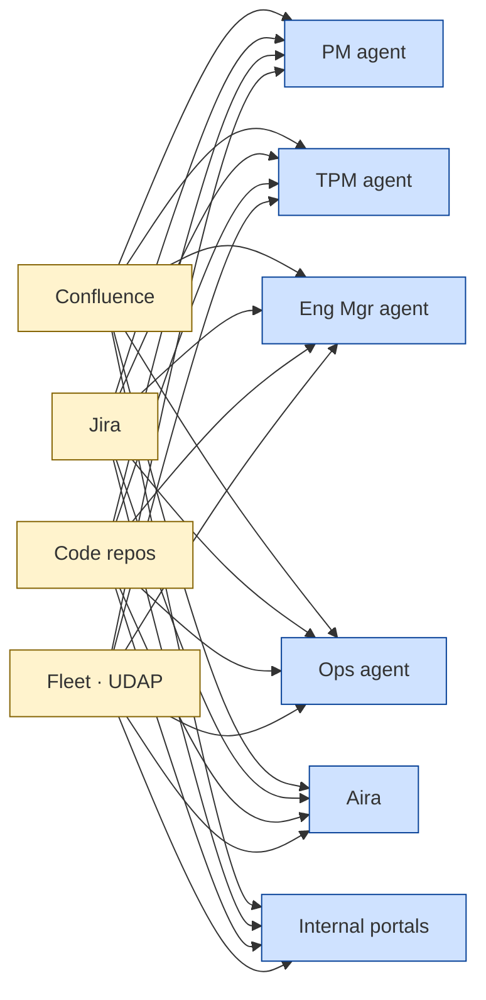
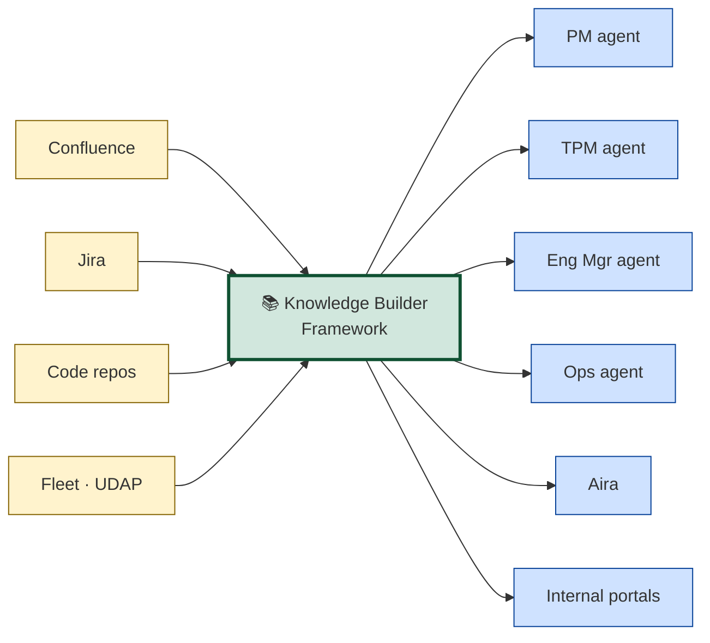
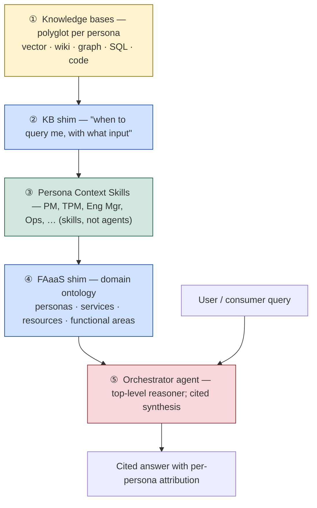
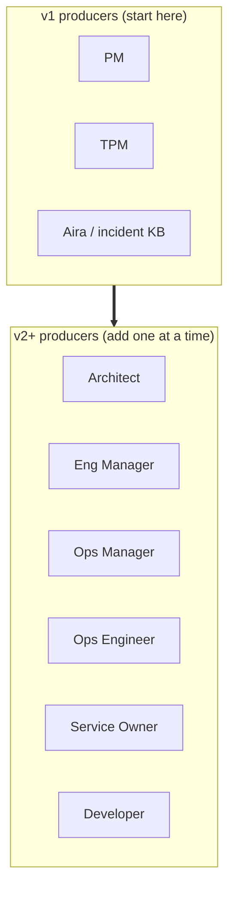
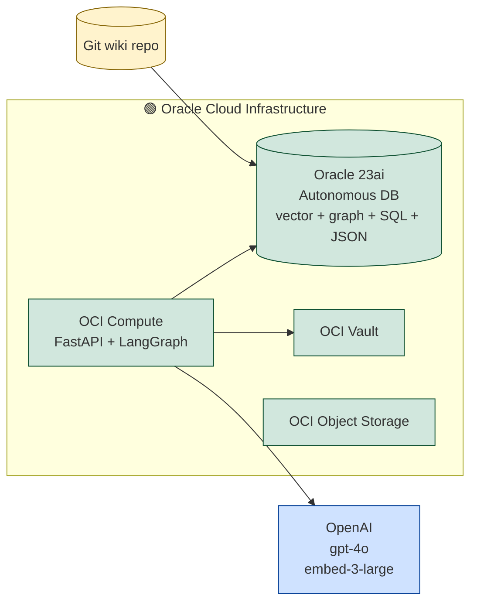
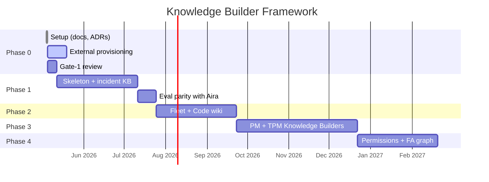
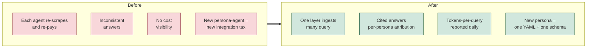

# Knowledge Builder Framework
### One knowledge layer for every AI agent in FAaaS

> Designed to be presented or read in 10 minutes. Each section is one "slide."
> Deeper detail on any section is one click away in the [PDD](pdd/PDD-Knowledge-Builder-Framework.md).

---

## SLIDE 1 — The problem



**Every AI agent in FAaaS is re-building context from scratch.**

- 🐢 Slow answers (every query re-pays the ingestion cost)
- 💸 Duplicated infra cost across consumers
- ❓ Inconsistent answers (each agent has its own outdated snapshot)
- 🚫 No citations, no eval gates, no cost visibility
- 📈 Each new persona-agent triples the integration tax

---

## SLIDE 2 — The vision



> **One layer ingests. Many consumers query.**
> Citations on every answer. Eval gates on every change. Costs visible per query.

---

## SLIDE 3 — Five-layer architecture (bottom-up)



| Layer | What it does | Owner |
|---|---|---|
| ① Knowledge bases | Each persona's data, in the right shape | Persona teams |
| ② KB shim | Each KB self-describes its capabilities | Auto-generated |
| ③ Persona skills | One skill per persona; fans out across that persona's KBs | Framework + persona prompts |
| ④ FAaaS shim | The domain ontology that lets the orchestrator route | Framework + curated |
| ⑤ Orchestrator | Picks skills, merges results, cites sources | Framework |

---

## SLIDE 4 — Polyglot per persona

A single persona's knowledge needs **multiple shapes**. We don't force everything into markdown.

```mermaid
flowchart LR
  classDef vector fill:#cfe2ff,stroke:#084298
  classDef wiki   fill:#d1e7dd,stroke:#0f5132
  classDef graph  fill:#f8d7da,stroke:#842029
  classDef sql    fill:#fff3cd,stroke:#856404

  subgraph OPS["Ops Engineer's knowledge_bases"]
    K1[ops_incidents<br/>📊 vector]:::vector
    K2[ops_runbooks<br/>📝 markdown wiki]:::wiki
    K3[ops_dependencies<br/>🕸️ graph]:::graph
    K4[ops_fleet_state<br/>🗄️ live SQL]:::sql
  end
```

**Match shape to the kind of knowledge:**
- 📝 Wiki = curated narrative (designs, runbooks, decisions)
- 📊 Vector = high-volume observations (incidents, tickets)
- 🕸️ Graph = relationships (resource hierarchy, service deps)
- 🗄️ SQL = enumerable state (live fleet, structured fields)

> One persona's knowledge_bases are heterogeneous *by design.* Doing it any other way means storing things in the wrong shape, paying for it later.

---

## SLIDE 5 — Personas



> **v1 starts narrow on purpose.** PM + TPM + Aira validate the contract end-to-end. Adding Eng Mgr, Ops Mgr, etc. afterwards is a YAML config + a JSON-Schema — no framework changes.

---

## SLIDE 6 — Tech stack



**Decided** (DECISION-001/002/003):
- **Oracle 23ai Autonomous Database** as one converged engine — vector + SQL + graph + JSON.
  - *Why this matters:* logical-polyglot (right shape per data type), physical-converged (one DB to operate). Backups, IAM, monitoring unify.
- **OpenAI** for LLM + embeddings (Oracle-certified) — `gpt-4o`, `text-embedding-3-large`.
- **LangGraph on OCI** for orchestration (control + debuggability).

> Lock-in posture: framework code stays provider-agnostic at two seams (`Store` interface, `LLMClient` shim) so a future swap is bounded.

---

## SLIDE 7 — Phase plan



| Phase | What ships | Business outcome |
|---|---|---|
| **0** ✅ done | Docs + ADRs + persona-builder contract | Engineering can start; leadership has a clear contract to approve |
| **1** | Incident KB end-to-end | Aira matches/beats current KB on a 25-question gold set with citations |
| **2** | Fleet read-through + Code wiki | Mixed-source queries work ("show fleet state for tenants impacted by INC-X") |
| **3** | PM + TPM Knowledge Builders | First non-incident persona KBs; resolves the "what to extract for narrative content" open problem |
| **4** | Permissions + FA semantic graph + cost dashboards | v2 ops posture; leadership-grade cost & SLO visibility |

Each phase ships **its own slice end-to-end** through ingestion → store → retrieval → eval. **No "build the whole framework first."**

---

## SLIDE 8 — Cost & quality discipline

```mermaid
flowchart LR
  classDef m fill:#cfe2ff,stroke:#084298
  PR[Every PR] --> CI[CI: eval harness]:::m
  CI --> M1[recall@k]:::m
  CI --> M2[faithfulness]:::m
  CI --> M3[latency p50/p95]:::m
  CI --> M4[$ cost per query]:::m
  M1 & M2 & M3 & M4 --> GATE{Pass?}
  GATE -- yes --> MERGE[merge]
  GATE -- no  --> BLOCK[blocked]
```

**Mandatory from v1** (spec §10):

- 🏷️ **Citations** — every answer cites sources; no citation = bug
- 🧪 **Eval gates** — every PR runs the gold-set; regressions block merge
- 💵 **Cost telemetry** — tokens-per-query, $/day, per persona
- 🔁 **Idempotency** — re-ingesting unchanged content does nothing
- 🔒 **ACL placeholders** — `persona_visibility` on every record (enforced in Phase 4)

> This is what makes the layer **trustworthy** for executive consumption later — every claim is citable, costs are predictable, quality is measured.

---

## SLIDE 9 — What changes for FAaaS



---

## SLIDE 10 — The asks

| # | What | From whom | When | Why |
|---|------|-----------|------|-----|
| 1 | **Approval of this PDD** (Gate 1) | Leadership | Now | Unblocks Phase 1 |
| 2 | **Oracle 23ai Autonomous DB** (dev tier) | Cloud ops | This week | Phase 1 cannot start without it |
| 3 | **OpenAI API access** (project + key, Vault-stored) | Vendor mgmt + cloud ops | This week | Every parser/synthesis call |
| 4 | **OCI Vault + secrets** (Confluence/Jira tokens) | Workplace IT + cloud ops | 1–2 weeks | Phase 1 ingestion sources |
| 5 | **Persona team commitments** (PM + TPM each name a Knowledge Builder owner) | Product / engineering leads | Before Phase 3 | Persona schemas need authors |
| 6 | **Ongoing OpenAI spend cap** (suggest $200/mo dev, $1K/mo Phase 1) | Finance | Phase 0 close | Cost ceiling before scale-up |

---

## SLIDE 11 — Risk & mitigation

| Risk | Mitigation |
|---|---|
| Oracle Autonomous DB SPOF | HA defaults (Data Guard) + eval-driven monitoring; per-schema metrics for granular restore |
| OpenAI as external dependency | `LLMClient` shim — swap to OCI Generative AI without rewriting call sites; explicit revisit conditions in DECISION-003 |
| Persona team velocity (each persona's schema needs authoring) | v1 narrows to 3 producers (PM + TPM + Aira); each new persona is config-only afterwards |
| Cost surprises | Per-call telemetry + per-PR eval cost cap ($0.50 default); hard CI cap ($5) to prevent runaway |
| Eval drift | Baseline pinned on `main`; baseline updates require justified PR |
| Vendor lock-in | Two clean seams (`Store`, `LLMClient`); persona configs are storage-agnostic |

---

## SLIDE 12 — What success looks like (12 months)

By **Phase 4 exit**:

- ✅ **3+ persona Knowledge Builders** in production (PM, TPM, Aira; expanding to Eng Mgr / Ops Mgr / Service Owner one at a time)
- ✅ **One MCP layer** queried by Aira + at least 2 internal consumers (portals or coding assistants)
- ✅ **>90% eval recall** on each persona's gold set; faithfulness >0.9
- ✅ **Per-query cost <$0.10 average** (excluding ingestion); daily $/query dashboard live
- ✅ **Per-incident response time** for Aira reduced (target: 30%) via cached, cited context
- ✅ **Onboarding cost** for a new persona-agent: **<2 weeks** (one YAML + one schema + gold set)
- ✅ **ACL enforcement** at retrieval — sensitive content invisible to unauthorized consumers

---

## SLIDE 13 — Deeper-dive references

If you want to go a layer deeper:

| Topic | Document |
|---|---|
| **Comprehensive product definition** | [PDD — Knowledge Builder Framework](pdd/PDD-Knowledge-Builder-Framework.md) |
| **The persona-builder contract** | [persona-knowledge-builder.md](persona-knowledge-builder.md), [ADR-004](adr/ADR-004-persona-builder-config.md) |
| **Tech stack rationale** | [ADR-001](adr/ADR-001-tech-stack-baseline.md) |
| **Storage shape per data type** | [ADR-002](adr/ADR-002-storage-shape.md) |
| **Core interfaces (developer-facing)** | [ADR-003](adr/ADR-003-core-interfaces.md) |
| **Eval discipline** | [ADR-005](adr/ADR-005-eval-harness.md) |
| **Phase 0 setup details** | [Phase 0 Kickoff Brief](../../pmo/phase-briefs/PHASE-0-kickoff.md) |
| **Source spec** | [`docs/raw/knowledge-builder-framework-spec.md`](../raw/knowledge-builder-framework-spec.md) |

---

## SLIDE 14 — Decision

> Reply `EXEC-APPROVED` and I unblock Phase 1.

If you'd rather we present this live, this brief converts cleanly to a 12-slide deck — happy to render to PowerPoint via the `pptx` skill on request.
