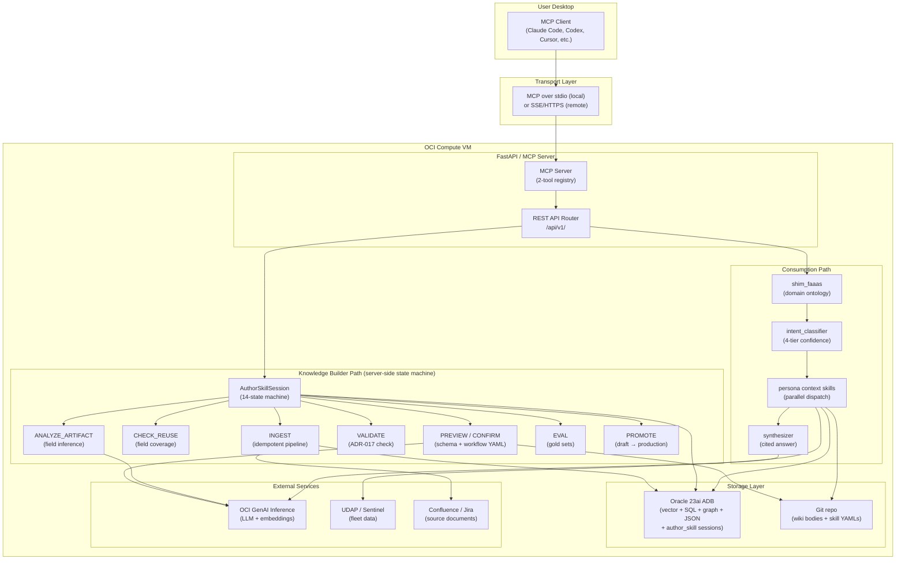
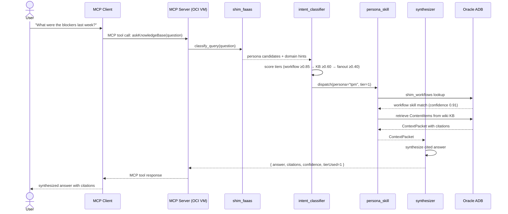
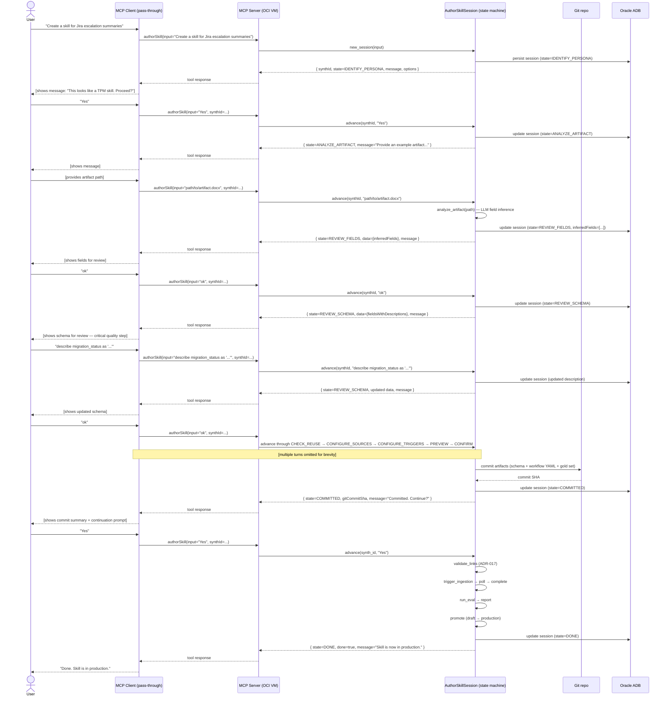

> **Naming convention (V3 rev 3):** The external API surface uses camelCase throughout — MCP tool names, REST JSON field names, and query parameter names. DB column names stay snake_case (PostgreSQL/Oracle convention); the API layer translates between the two. Python internal code (dict keys, variable names) also stays snake_case per Python convention. Only the external surface visible to clients is camelCase.

# Product Definition Document V3 — Knowledge Builder Framework
# Deployment Interaction Layer

> **Status:** Draft V3 (rev 2) — extends V2 with the deployment interaction layer. V2 defines the internal architecture (shims, routing, skills, data model). V3 defines the external surface: how users and their AI assistants on desktops talk to the framework hosted on an OCI compute VM.
>
> **Audience:** Engineering team implementing the REST + MCP server; developers wiring MCP clients (Claude Code, Codex, Cursor, or any MCP-compatible tool) to the framework; platform engineers sizing and operating the OCI VM.
>
> **What V3 adds:** The two interaction models (Consumption Flow vs Knowledge Builder Flow), the complete REST API surface (6 endpoints — 1 consumption + 5 session-based knowledge builder), MCP tool catalog (2 tools), deployment topology, per-KB storage kinds, and implementation guidance. V2 is the authoritative reference for everything inside the framework box; V3 defines what is visible outside that box.
>
> **Rev 2 changes (2026-05-10):** MCP surface collapsed from 13 tools to 2. Knowledge builder flow converted from 12 atomic client-orchestrated APIs to a single server-side state machine with 5 session-management endpoints. Persona discovery, schema review, and post-commit operations (validate/ingest/eval/promote) are now inside the state machine. Session persistence added (ADB-backed, 7-day TTL). New REVIEW_SCHEMA state added between REVIEW_FIELDS and CHECK_REUSE.
>
> **Rev 3 changes (2026-05-10):** External API surface converted to camelCase throughout. MCP tool names: `askKnowledgeBase`, `authorSkill`. REST endpoint: `/api/v1/kb/authorSkill`. All JSON request/response field names are camelCase. DB column names unchanged (snake_case, PostgreSQL/Oracle convention). Python internal code unchanged (snake_case, Python convention).

---

## 1. What V3 adds to V2

V2 defined the internal architecture:
- Two flows (Knowledge Builder + Consumption)
- Three-shim architecture (shim_faaas, shim_workflows, shim_kb)
- Four-tier routing with confidence-driven degradation
- Workflow skills as first-class artifacts
- Extraction–workflow linking (requires_extractions / provides_fields)
- Skill-by-demonstration onboarding

V3 answers the question: **How does a user with an MCP client on their laptop actually use this framework?**

The answer has two distinct interaction models — one for querying knowledge, one for building knowledge — with different tool surfaces and different architectural roles for the client AI.

---

## 2. The two interaction models

### 2.1 Consumption Flow — "ask the knowledge base"

The user's AI assistant is a thin client. All routing intelligence lives server-side.

```
┌────────────────────────────────────────────────────────────────────────┐
│  User Desktop                                                           │
│                                                                        │
│  MCP Client (Claude Code, Codex, Cursor, etc.)                         │
│       │                                                                │
│       │  MCP tool call:  askKnowledgeBase(question, persona?)          │
│       ▼                                                                │
│  MCP Client (stdio or SSE transport)                                   │
└───────────────────────────┬────────────────────────────────────────────┘
                            │  HTTPS / MCP transport
                            ▼
┌───────────────────────────────────────────────────────────────────────┐
│  OCI Compute VM                                                        │
│                                                                        │
│  MCP Server (FastAPI)                                                  │
│       │                                                                │
│       │  POST /api/v1/ask                                              │
│       ▼                                                                │
│  shim_faaas  →  intent_classifier  →  persona routing                 │
│       │                                                                │
│       ├── Tier 1: workflow skill match (≥0.85 confidence)             │
│       ├── Tier 2: KB retrieval (≥0.60)                                │
│       ├── Tier 3: multi-persona fanout (≥0.40)                        │
│       └── Tier 4: honest "no answer" (<0.40)                          │
│                                                                        │
│       ▼                                                                │
│  Synthesizer → cited answer + confidence + tier_used                  │
└───────────────────────────────────────────────────────────────────────┘
```

**The client never sees internal routing.** The FAaaS shim, tier classification, persona dispatch, KB retrieval, and synthesis are all opaque server-side concerns. The client submits a question and receives a synthesized, cited answer.

**Why this matters:** Exposing low-level retrieval tools directly (vector_search, get_incident_summary, etc.) to the MCP client would bypass the shim_faaas routing logic. The client would need to know which persona to route to, which KB to query, what confidence threshold to apply — this is exactly what the framework is designed to abstract away. The single `askKnowledgeBase` tool is the enforced entry point.

### 2.2 Knowledge Builder Flow — "author a new skill"

The user's AI assistant is a **pass-through**, not an orchestrator. The server maintains all state machine logic. The client's role is: show the server's message to the user, collect user input, POST that input back to the same endpoint, repeat.

```
┌────────────────────────────────────────────────────────────────────────┐
│  User Desktop                                                           │
│                                                                        │
│  MCP Client (pass-through — no orchestration knowledge)                │
│       │                                                                │
│       │  MCP tool call:  authorSkill(input, synthId?)                 │
│       │                                                                │
│       │  Pattern:                                                      │
│       │    POST input → receive {message, options, state, done}        │
│       │    Show message to user                                        │
│       │    Collect user response                                       │
│       │    POST response → receive next {message, ...}                 │
│       │    Repeat until done=true (camelCase in all JSON)              │
│       ▼                                                                │
│  MCP Client (stdio or SSE transport)                                   │
└───────────────────────────┬────────────────────────────────────────────┘
                            │  HTTPS / MCP transport
                            ▼
┌───────────────────────────────────────────────────────────────────────┐
│  OCI Compute VM                                                        │
│                                                                        │
│  MCP Server (FastAPI)  →  REST API  →  Author-Skill Session module    │
│       │                                                                │
│  /api/v1/kb/authorSkill  (5 session-management endpoints)             │
│       │                                                                │
│  State machine (server-side, ADB-persisted):                          │
│  IDENTIFY_PERSONA → ANALYZE_ARTIFACT → REVIEW_FIELDS →               │
│  REVIEW_SCHEMA → CHECK_REUSE → CONFIGURE_SOURCES →                   │
│  CONFIGURE_TRIGGERS → PREVIEW → CONFIRM → COMMITTED →                 │
│  VALIDATE → INGEST → EVAL → PROMOTE → DONE                            │
└───────────────────────────────────────────────────────────────────────┘
```

**The server is the orchestrator here.** Each `author_skill` call advances the server-side state machine by one step. The client never decides what happens next — the server tells it what to show the user and what inputs to accept. This is the correct design because:

1. The state machine is deterministic and testable on the server — no orchestration logic scattered across client prompts
2. Sessions are durable — users can leave mid-session and resume hours later without losing progress
3. The MCP client is a pass-through — it does not need to understand the workflow or hold state across turns
4. The user gets a consistent authoring experience regardless of which MCP client they use (Claude Code, Codex, Cursor, or any MCP-compatible tool)

**Key invariant:** The MCP client calls `authorSkill` exactly as it calls `askKnowledgeBase` — it posts input, gets a response, and shows that response to the user. No orchestration knowledge required.

---

## 3. Architecture overview



---

## 4. Deployment topology

### Single OCI Compute VM

All framework components run on one VM in v1. The design is modular and can be split if scale demands, but a single VM is correct for the current team size and query volume.

```
OCI Compute VM (e2.standard.4 or equivalent — 4 OCPU, 32 GB RAM)
├── FastAPI process (MCP server + REST router) — port 8080
│   ├── Listens: localhost (stdio MCP mode) or 0.0.0.0:8080 (SSE/HTTPS mode)
│   ├── Workers: 4 Uvicorn workers
│   └── Startup: loads shim_faaas into memory; validates all persona-builder configs
├── Ingestion worker process (OCI Functions or background thread)
│   ├── Polls / receives webhooks from Confluence, Jira, Git
│   └── Writes to ADB via ingestion pipeline
├── Scheduler process
│   ├── workflow_runtime/trigger_dispatcher.py (cron-based)
│   └── Fires ON_SCHEDULE workflow skills
└── Nginx reverse proxy (TLS termination, /healthz pass-through)

Network connections (outbound from VM):
├── Oracle 23ai ADB — TLS to ADB FQDN (wallet-based auth)
├── OCI GenAI Inference — HTTPS to OCI endpoint (instance principal auth)
├── Git repo (wiki) — SSH or HTTPS to Git hosting
├── Confluence — HTTPS (token auth, from OCI Vault)
├── Jira — HTTPS (token auth, from OCI Vault)
└── UDAP / Sentinel — internal network (read-through adapter)
```

### Transport options for MCP

| Mode | When to use | Config |
|------|-------------|--------|
| **stdio** | MCP client on same machine as VM (SSH tunnel or local) | `MCP_TRANSPORT=stdio` in env |
| **SSE / HTTPS** | MCP client on developer laptop connecting to remote OCI VM | `MCP_TRANSPORT=sse`, `MCP_PORT=8080`, reverse proxy with TLS |

For most team members, SSE over HTTPS with a bearer token is the deployment target. The stdio mode is useful for local development and laptop quickstart.

### OCI services used

| Service | Role |
|---------|------|
| OCI Compute (VM.Standard.E4) | Runs the FastAPI server, ingestion worker, scheduler |
| Oracle 23ai Autonomous Database | Vector store, wiki metadata, graph store, relational shim tables, author_skill session state |
| OCI Vault | Stores API keys (Confluence, Jira, OpenAI fallback), bearer tokens |
| OCI Generative AI Inference | LLM inference (completion + embeddings) — wraps OpenAI compat API |
| OCI Object Storage | Workflow skill output delivery (PPT/DOCX artifacts) |
| OCI Email Delivery | Workflow skill email deliveries |
| Git (any host — GitHub, GitLab, OCI DevOps) | Wiki content bodies, workflow skill YAMLs, extraction schemas |

---

## 5. Consumption Flow — REST API

### 5.1 Endpoint

```
POST /api/v1/ask
```

This is the single entry point for all knowledge queries. The server routes internally through the four-tier system. The client never specifies which KB, retriever, or persona skill to use.

### 5.2 Request schema

```json
{
  "question": "string (required) — the natural language question or task",
  "persona": "string | null — hint: restrict routing to this persona's shim scope",
  "serviceId": "string | null — hint: restrict to content tagged with this service",
  "functionalArea": "string | null — hint: restrict to this functional area dimension",
  "maxResults": "integer | null — max KB results to gather per persona (default: 10)"
}
```

**`persona` and `serviceId` are hints, not hard filters.** The intent classifier makes the final routing decision. If a hint contradicts a high-confidence classification, the classifier wins. This prevents the client from bypassing routing logic.

Example request:

```json
{
  "question": "What were the root causes of the last 3 pod DB incidents?",
  "persona": "ops_eng",
  "serviceId": null,
  "functionalArea": null,
  "maxResults": 10
}
```

### 5.3 Response schema

```json
{
  "answer": "string — synthesized natural language answer with inline citations",
  "citations": [
    {
      "contentId": "string",
      "chunkId": "string | null",
      "text": "string — the evidence passage",
      "citationUrl": "string — source URL (always present; bug if absent)",
      "score": "float — retrieval confidence",
      "metadata": {
        "persona": "string",
        "kind": "string",
        "functionalArea": ["string"],
        "resources": ["string"],
        "services": ["string"],
        "sourceSha": "string",
        "schemaVersion": 1
      }
    }
  ],
  "confidence": "float — overall confidence of the answer (0.0–1.0)",
  "tierUsed": "integer — which tier produced the answer (1, 2, 3, or 4)",
  "tierDescription": "string — human-readable: 'workflow_skill' | 'kb_retrieval' | 'multi_persona_fanout' | 'no_answer'",
  "costTokens": {
    "prompt": "integer",
    "completion": "integer",
    "total": "integer"
  },
  "skillSuggestion": {
    "offered": "boolean — true if Tier 4 triggered a skill suggestion",
    "message": "string | null — suggestion message shown to user",
    "candidateId": "string | null — ID of the logged skill candidate"
  }
}
```

### 5.4 Error responses

```json
{
  "error": {
    "code": "string",
    "message": "string",
    "details": {}
  }
}
```

| HTTP Status | Error Code | Condition |
|-------------|------------|-----------|
| 400 | `invalid_argument` | question is empty or exceeds 4096 chars |
| 401 | `unauthenticated` | missing or invalid bearer token |
| 403 | `permission_denied` | token lacks read scope for requested persona |
| 429 | `rate_limited` | per-token RPM cap exceeded |
| 503 | `upstream_unavailable` | ADB or GenAI unreachable |
| 524 | `budget_exceeded` | per-request token budget exhausted |

### 5.5 Tier 4 skill suggestion

When the framework hits Tier 4 (confidence < 0.40), the response includes a `skillSuggestion` block. The MCP tool surfaces this to the user via the MCP client:

```
"I couldn't find a grounded answer. Closest content was in the ops_eng KB
 (confidence: 0.31). This query type has been logged.

 Want to scaffold a workflow skill for queries like this?
 [start skill builder] [no thanks]"
```

Failed query patterns are logged to `kb_shim.skill_candidates` with persona attribution and frequency counts.

---

## 6. Knowledge Builder Flow — REST API

The Knowledge Builder flow is a **server-side stateful session API**. The client does not orchestrate the sequence of steps — the server's state machine drives the conversation. The client's only job is to relay the server's messages to the user and post the user's replies back.

### 6.1 Endpoint map

All five session-management endpoints live under `/api/v1/kb/authorSkill`.

| Method | Path | Purpose |
|--------|------|---------|
| POST | `/api/v1/kb/authorSkill` | Start a new authoring session (or resume if `synthId` provided in body) |
| POST | `/api/v1/kb/authorSkill/{synthId}` | Continue an in-progress session — advance the state machine |
| GET | `/api/v1/kb/authorSkill` | List all authoring sessions for the authenticated user |
| GET | `/api/v1/kb/authorSkill/{synthId}` | Get the current state of a specific session (without advancing it) |
| DELETE | `/api/v1/kb/authorSkill/{synthId}` | Cancel / abandon an in-progress session |

There are no additional endpoints for persona listing, schema listing, artifact analysis, field review, commit, validate, ingest, eval, or promote. All of these are internal operations performed by the state machine — the client never calls them directly.

### 6.2 Universal session response envelope

Every POST to an author-skill endpoint returns the same envelope regardless of which state the machine is in:

```json
{
  "synthId": "synth-tpm-weekly_exec_review-20260510-a3f1",
  "state": "REVIEW_SCHEMA",
  "message": "string — what to show the user right now",
  "data": { ... },
  "options": ["ok", "describe <field> as <text>", "set type of <field> to <type>"],
  "progress": {
    "step": 5,
    "total": 14,
    "label": "Review extraction schema"
  },
  "done": false
}
```

Field semantics:

| Field | Type | Description |
|-------|------|-------------|
| `synthId` | string | Unique session ID. Created on first POST, returned on every subsequent call. |
| `state` | string | Current state of the machine (one of the 14 states below). |
| `message` | string | The text to show the user. Plain English. No client formatting required. |
| `data` | object | State-specific payload (schema fields, preview content, eval results, etc.). |
| `options` | array of strings | The accepted input patterns for this state. Used by the MCP client to guide the user. |
| `progress` | object | Step counter and human label for the current state. |
| `done` | boolean | True only in the DONE state. When true, the session is complete and archived. |

### 6.3 The 14-state machine

```
IDENTIFY_PERSONA
      │  server analyzes intent → suggests persona → user confirms or picks
      ▼
ANALYZE_ARTIFACT
      │  user provides artifact path/URL → server infers fields and slide mapping
      ▼
REVIEW_FIELDS
      │  user reviews inferred fields → edits (add/remove/rename) → confirms
      ▼
REVIEW_SCHEMA
      │  user reviews each field's type + description (extraction instruction)
      │  user edits descriptions to improve extraction quality → confirms
      ▼
CHECK_REUSE
      │  server checks which fields are already covered by existing KBs
      │  presents reuse analysis → user decides whether to extend or create new
      ▼
CONFIGURE_SOURCES
      │  user specifies Confluence spaces, Jira filters, Git repos to pull from
      ▼
CONFIGURE_TRIGGERS
      │  user specifies when the skill should run (cron schedule / on_request / both)
      ▼
PREVIEW
      │  server synthesizes all artifacts (schema JSON, persona-builder diff, workflow YAML)
      │  server shows user a human-readable summary + diff
      ▼
CONFIRM
      │  user approves → server commits all artifacts to git
      ▼
COMMITTED
      │  server asks: "Want me to validate, ingest, and run eval now?"
      │  user can proceed through the full pipeline or stop at any point
      ▼
VALIDATE
      │  server runs ADR-017 link validation (requires_extractions ⊆ provides_fields)
      ▼
INGEST
      │  server triggers ingestion pipeline → polls until complete → reports results
      ▼
EVAL
      │  server runs eval harness against gold sets → reports recall@k, faithfulness
      ▼
PROMOTE
      │  server promotes skill from draft → production (blocked if eval gate not met)
      ▼
DONE
```

The user can stop after any state — sessions persist for 7 days and can be resumed from where they left off.

### 6.4 State-by-state detail

#### IDENTIFY_PERSONA

The server analyzes the user's initial intent message to suggest a persona. It also shows all available personas with their current skill counts so the user can browse.

Input accepted: `"[persona name]"` to confirm, or `"list"` to see all personas.

`data` payload:
```json
{
  "suggestedPersona": "ops_eng",
  "suggestionReason": "Your intent mentions ADB-S migration, which matches ops_eng skills.",
  "availablePersonas": [
    {"name": "tpm", "displayName": "Technical Program Manager", "skillCount": 3},
    {"name": "ops_eng", "displayName": "Operations Engineer", "skillCount": 2}
  ]
}
```

#### ANALYZE_ARTIFACT

The server accepts a file path or URL pointing to an example artifact (PPT, DOCX, Markdown, email, Confluence page). It runs LLM-based field inference and returns the inferred fields with a slide/section mapping.

Input accepted: `"[file_path_or_url]"` pointing to the artifact.

`data` payload:
```json
{
  "artifactPath": "path/to/example.pptx",
  "inferredFields": [
    {"name": "migration_status", "type": "string", "foundIn": "slide_2"},
    {"name": "pod_count", "type": "integer", "foundIn": "slide_3"},
    {"name": "canary_region", "type": "string", "foundIn": "slide_2"}
  ],
  "confidence": 0.87,
  "analysisNotes": "Found 3 structured fields across 2 slides.",
  "costTokens": {"prompt": 1240, "completion": 310, "total": 1550}
}
```

#### REVIEW_FIELDS

The user reviews and edits the inferred fields. They can add new fields, remove fields they do not need, or rename fields.

Input accepted:
- `"ok"` — accept all fields as shown
- `"add [field_name] as [type]"` — add a new field
- `"remove [field_name]"` — drop a field
- `"rename [old_name] to [new_name]"` — rename a field

`data` payload: same as ANALYZE_ARTIFACT's `inferredFields` list, updated with any edits.

#### REVIEW_SCHEMA

**New state — critical for extraction quality.**

The server shows each field with its inferred JSON-Schema type and description. The description is the extraction instruction the LLM parser uses to extract this field from source documents. Poor descriptions produce poor extractions — this state gives the user an explicit opportunity to review and improve them before anything is committed.

The user must explicitly confirm (`"ok"`) or edit before the machine advances.

Input accepted:
- `"ok"` — accept all field descriptions as shown
- `"describe [field_name] as [text]"` — rewrite the extraction instruction for a field
- `"set type of [field_name] to [type]"` — change the JSON-Schema type of a field
- `"show [field_name]"` — show the full current description for a single field

Example `data` payload:
```json
{
  "fields": [
    {
      "name": "migration_status",
      "type": "string",
      "description": "Status of OC1 pod migration from ExaCS to ADB-S. Extract: canary region, pod counts, pause state.",
      "enum": null,
      "example": "canary_done_emea_paused_us"
    },
    {
      "name": "pod_count",
      "type": "integer",
      "description": "Total number of pods migrated to ADB-S in this reporting period.",
      "enum": null,
      "example": 47
    },
    {
      "name": "canary_region",
      "type": "string",
      "description": "Name of the region used for canary deployment. Usually a 3-letter OCI region code.",
      "enum": null,
      "example": "FRA"
    }
  ],
  "schemaNotes": "The 'description' field is what the LLM parser uses as its extraction instruction. Edit these carefully — they directly determine extraction quality."
}
```

Example user interactions in REVIEW_SCHEMA:

```
Server: "Review the extraction instructions for your 3 fields. Edit any that are unclear.
         Type 'ok' to confirm all, or use 'describe <field> as <text>' to refine.

         migration_status (string): Status of OC1 pod migration from ExaCS to ADB-S. Extract: canary region, pod counts, pause state.
         pod_count (integer): Total number of pods migrated to ADB-S in this reporting period.
         canary_region (string): Name of the region used for canary deployment. Usually a 3-letter OCI region code."

User: "describe migration_status as 'Current migration state for the ADB-S provisioning project. One of: canary_running, canary_complete, paused, complete. Include the region context if provided.'"

Server: "Updated. Remaining fields:
         pod_count (integer): Total number of pods migrated to ADB-S in this reporting period.
         canary_region (string): Name of the region used for canary deployment. Usually a 3-letter OCI region code.
         Type 'ok' to confirm, or continue editing."

User: "ok"

Server: [advances to CHECK_REUSE]
```

#### CHECK_REUSE

The server checks whether any existing extraction KBs already cover the confirmed fields. It reports which fields can be reused and which require new extraction or schema extension.

Input accepted:
- `"create new"` — create a brand-new extraction KB for all fields
- `"extend [kb_name]"` — extend an existing KB to add the gap fields
- `"ok"` — accept the server's recommendation

`data` payload:
```json
{
  "covered": {
    "migration_status": "ops_eng.adb_s_provisioning"
  },
  "gaps": ["pod_count", "canary_region"],
  "reusePercentage": 0.33,
  "recommendation": "Extend existing KB ops_eng.adb_s_provisioning to add 2 fields.",
  "existingKbs": [
    {
      "kbName": "ops_eng.adb_s_provisioning",
      "providesFields": ["migration_status", "ticket_id", "region"],
      "status": "production"
    }
  ]
}
```

#### CONFIGURE_SOURCES

The user specifies which raw sources the extraction KB should pull from.

Input accepted: free-text descriptions of sources, e.g.:
- `"Confluence space: OPS, label: adb-s-migration"`
- `"Jira filter: project = OPS AND component = ADB-S"`
- `"done"` — finish configuring sources

`data` payload: accumulated list of configured sources so far.

#### CONFIGURE_TRIGGERS

The user specifies when the workflow skill should run.

Input accepted:
- `"on_request"` — only when explicitly invoked
- `"schedule: [cron]"` — run on a cron schedule, e.g. `"schedule: 0 9 * * 1"` (every Monday at 9am)
- `"both"` — on_request AND a schedule (user then specifies the cron)

`data` payload: current trigger configuration.

#### PREVIEW

The server synthesizes all artifacts (extraction schema JSON, persona-builder YAML diff, workflow skill YAML, gold set seeds) and presents a human-readable summary. The user reviews before any git commit happens.

Input accepted:
- `"ok"` / `"commit"` — approve and advance to CONFIRM
- `"show schema"` — display the full extraction schema JSON
- `"show workflow"` — display the full workflow YAML
- `"back"` — return to CONFIGURE_TRIGGERS to change settings

`data` payload:
```json
{
  "artifactsToCreate": [
    {
      "path": "framework/parsers/schemas/ops_eng/adb_s_migration_status/v1.json",
      "kind": "extraction_schema",
      "description": "JSON-Schema with 3 fields"
    },
    {
      "path": "framework/persona_builders/ops-eng.yaml",
      "kind": "persona_builder_diff",
      "description": "Adds KB: ops_eng.adb_s_migration_status"
    },
    {
      "path": "framework/workflow_skills/ops_eng/adb_s_migration_status.yaml",
      "kind": "workflow_skill",
      "description": "Workflow skill — schedule: 0 9 * * 1, output: markdown"
    },
    {
      "path": "eval/gold_sets/ops_eng-adb_s_migration_status-extraction.jsonl",
      "kind": "extraction_gold_set",
      "description": "Seed gold set from example artifact (1 entry)"
    }
  ],
  "linkValidation": {
    "passed": true,
    "coverage": "3/3 required fields covered"
  }
}
```

#### CONFIRM

The server requests a final explicit confirmation before committing to git. This is the last opportunity to abort.

Input accepted:
- `"yes"` / `"confirm"` — commit all artifacts
- `"no"` / `"cancel"` — abandon the session

#### COMMITTED

All artifacts have been committed to git. The server reports the commit SHA and asks whether the user wants to continue through validate → ingest → eval → promote.

Input accepted:
- `"yes"` / `"continue"` — proceed to VALIDATE
- `"stop"` — stop here; session saved; user can resume later

`data` payload:
```json
{
  "committedPaths": [
    "framework/parsers/schemas/ops_eng/adb_s_migration_status/v1.json",
    "framework/workflow_skills/ops_eng/adb_s_migration_status.yaml"
  ],
  "gitCommitSha": "a3f1b2c...",
  "message": "All artifacts committed. Want me to validate, ingest, and run eval now?"
}
```

#### VALIDATE

Runs ADR-017 link validation (requires_extractions ⊆ provides_fields). Reports pass/fail.

Input accepted: `"ok"` to advance (if passed) or `"show errors"` to see details.

#### INGEST

Triggers the ingestion pipeline. The server polls for completion internally and reports the result when done (or provides a poll update if the user resumes the session later).

Input accepted: `"ok"` to advance after ingestion completes.

#### EVAL

Runs the eval harness against the gold sets. Reports recall@k, faithfulness, latency, and cost.

Input accepted:
- `"ok"` — advance to PROMOTE (only available if eval exit criteria passed)
- `"show report"` — show full eval report path

#### PROMOTE

Promotes the skill from `status: draft` to `status: production`. Blocked if eval gate not met. Reports final promotion status.

Input accepted: `"ok"` to complete.

#### DONE

Terminal state. Session is archived. The user receives a summary of everything that was created.

`done: true` is set. No further input is accepted on this session.

### 6.5 Starting a session — `POST /api/v1/kb/authorSkill`

Request (no `synthId` in body = new session):
```json
{
  "input": "I want to automate weekly ADB-S migration status updates for ops engineering"
}
```

Response (new session created, machine is in IDENTIFY_PERSONA state):
```json
{
  "synthId": "synth-ops_eng-adb_s_migration-20260510",
  "state": "IDENTIFY_PERSONA",
  "message": "I'll help you build that skill. Based on your intent, this looks like an ops_eng skill — it's about ADB-S migration tracking, which is squarely in Operations Engineering territory.\n\nAvailable personas:\n  - ops_eng (Operations Engineer) — 2 skills\n  - tpm (Technical Program Manager) — 3 skills\n  - pm (Product Manager) — 1 skill\n  - architect — 2 skills\n\nShall I proceed with ops_eng?",
  "data": {
    "suggestedPersona": "ops_eng",
    "suggestionReason": "Intent mentions ADB-S migration, which matches ops_eng skills.",
    "availablePersonas": [
      {"name": "ops_eng", "displayName": "Operations Engineer", "skillCount": 2},
      {"name": "tpm", "displayName": "Technical Program Manager", "skillCount": 3}
    ]
  },
  "options": ["yes / ops_eng", "tpm", "pm", "architect", "list"],
  "progress": {"step": 1, "total": 14, "label": "Identify persona"},
  "done": false
}
```

### 6.6 Continuing a session — `POST /api/v1/kb/authorSkill/{synthId}`

Request:
```json
{
  "input": "yes"
}
```

Response (machine advances to ANALYZE_ARTIFACT):
```json
{
  "synthId": "synth-ops_eng-adb_s_migration-20260510",
  "state": "ANALYZE_ARTIFACT",
  "message": "Great — ops_eng it is. Do you have an example artifact I can analyze? This could be a PPT, DOCX, Markdown file, Confluence page URL, or email. Provide a file path or URL.",
  "data": {
    "persona": "ops_eng",
    "acceptedFormats": ["pptx", "docx", "md", "pdf", "confluence_url", "email"]
  },
  "options": ["[file_path_or_url]", "skip — I'll describe the fields manually"],
  "progress": {"step": 2, "total": 14, "label": "Analyze artifact"},
  "done": false
}
```

### 6.7 Listing sessions — `GET /api/v1/kb/authorSkill`

Returns all authoring sessions for the authenticated user, ordered by `updatedAt` descending.

Response:
```json
{
  "sessions": [
    {
      "synthId": "synth-ops_eng-adb_s_migration-20260510",
      "persona": "ops_eng",
      "skillName": "adb_s_provisioning_migration_status",
      "intent": "Automate weekly ADB-S migration status updates",
      "state": "REVIEW_SCHEMA",
      "progress": {"step": 5, "total": 14, "label": "Review extraction schema"},
      "createdAt": "2026-05-10T10:00:00Z",
      "updatedAt": "2026-05-10T14:32:00Z",
      "expiresAt": "2026-05-17T14:32:00Z",
      "status": "in_progress"
    },
    {
      "synthId": "synth-tpm-weekly_exec-20260509",
      "persona": "tpm",
      "skillName": "weekly_exec_review",
      "intent": "Produce weekly exec review PPT",
      "state": "DONE",
      "progress": {"step": 14, "total": 14, "label": "Done"},
      "createdAt": "2026-05-09T09:00:00Z",
      "updatedAt": "2026-05-09T16:00:00Z",
      "expiresAt": null,
      "status": "promoted"
    }
  ]
}
```

`status` values: `in_progress` | `committed` | `promoted` | `abandoned` | `expired`

### 6.8 Getting session state — `GET /api/v1/kb/authorSkill/{synthId}`

Returns the current state of the session without advancing the machine. Used to inspect a session before resuming it.

Response: same as the POST response envelope, with an additional `sessionSummary` field:
```json
{
  "synthId": "synth-ops_eng-adb_s_migration-20260510",
  "state": "REVIEW_SCHEMA",
  "message": "Review the extraction instructions for your 3 fields. Edit any that are unclear...",
  "data": { ... },
  "options": ["ok", "describe <field> as <text>", "set type of <field> to <type>"],
  "progress": {"step": 5, "total": 14, "label": "Review extraction schema"},
  "done": false,
  "sessionSummary": {
    "persona": "ops_eng",
    "intent": "Automate weekly ADB-S migration status updates",
    "artifactPath": "path/to/example.pptx",
    "fieldsConfirmed": ["migration_status", "pod_count", "canary_region"],
    "sourcesConfigured": [],
    "triggersConfigured": null
  }
}
```

### 6.9 Cancelling a session — `DELETE /api/v1/kb/authorSkill/{synthId}`

Marks the session as `abandoned`. No git changes are rolled back (if the session was in COMMITTED or later state, commits are kept). Sessions in `abandoned` state are cleaned up after 7 days.

Response:
```json
{
  "synthId": "synth-ops_eng-adb_s_migration-20260510",
  "status": "abandoned",
  "message": "Session abandoned. No files were committed.",
  "committedBeforeAbandon": false
}
```

### 6.10 Error responses

```json
{
  "error": {
    "code": "string",
    "message": "string",
    "details": {}
  }
}
```

| HTTP Status | Error Code | Condition |
|-------------|------------|-----------|
| 400 | `invalid_input` | Input does not match any accepted option for the current state |
| 401 | `unauthenticated` | Missing or invalid bearer token |
| 403 | `permission_denied` | Token lacks write scope |
| 404 | `session_not_found` | `synthId` does not exist or belongs to a different user |
| 409 | `session_expired` | Session TTL has elapsed; user must start a new session |
| 409 | `session_done` | Session is in DONE state; no further input accepted |
| 429 | `rate_limited` | Per-token RPM cap exceeded |
| 503 | `upstream_unavailable` | ADB or GenAI unreachable |

---

## 7. MCP tool surface

The MCP server exposes exactly **two tools** to external clients. Everything else is internal.

### 7.1 Consumption tool

```python
@mcp_tool("askKnowledgeBase")
def ask_knowledge_base(
    question: str,
    persona: str = None,
    service_id: str = None,       # maps to JSON "serviceId"
    functional_area: str = None,  # maps to JSON "functionalArea"
    max_results: int = 10,        # maps to JSON "maxResults"
) -> dict:
    """
    Single entry point for all knowledge queries.

    MCP tool name (external): askKnowledgeBase
    Python function name (internal): ask_knowledge_base  (snake_case — Python convention)
    JSON parameters use camelCase: serviceId, functionalArea, maxResults

    The framework routes internally through a four-tier system:
    - Tier 1: workflow skill match (curated artifact output)
    - Tier 2: KB retrieval + synthesis (cited answer from raw content)
    - Tier 3: multi-persona fanout (answer from multiple persona KBs)
    - Tier 4: honest "no answer" with skill suggestion

    The caller never specifies which KB, retriever, or persona skill to use.
    Returns: { answer, citations[], confidence, tierUsed, costTokens, skillSuggestion }
    """
```

**This is the only tool an MCP client should call for knowledge consumption.** Calling low-level retrieval tools directly (vector_search, get_incident_summary, etc.) bypasses the routing shim and is not supported as an external interface.

### 7.2 Knowledge builder tool

```python
@mcp_tool("authorSkill")
def author_skill(
    input: str,
    synth_id: str = None,  # maps to JSON "synthId"
) -> dict:
    """
    Single entry point for the knowledge builder flow.

    MCP tool name (external): authorSkill
    Python function name (internal): author_skill  (snake_case — Python convention)
    JSON field "synthId" maps to parameter synth_id internally.

    Pass-through pattern:
    1. Call with synthId=null (JSON) to start a new authoring session.
    2. Receive { synthId, state, message, data, options, progress, done }.
    3. Show `message` to the user.
    4. Collect the user's reply.
    5. Call again with the same synthId and the user's reply as `input`.
    6. Repeat until done=true.

    To resume an existing session: call with the synthId of the in-progress session.

    The server drives all state transitions. The client does not need to know
    which state the machine is in or what happens next.

    Returns: { synthId, state, message, data, options, progress, done }
    """
```

### 7.3 Tool count rationale

The external MCP surface is intentionally minimal:

| Tool | Maps to | Pattern |
|------|---------|---------|
| `askKnowledgeBase` | `POST /api/v1/ask` | Post question → get answer (single call) |
| `authorSkill` | `POST /api/v1/kb/authorSkill[/{synthId}]` | Post input → get next prompt → loop |

**Why only 2 tools, not 13?**

- **The MCP client does not need orchestration knowledge.** With 13 atomic tools, the client had to know the correct call sequence, manage intermediate state (`synthId`, fields, slide mapping, etc.), apply judgment about when to advance vs. ask, and handle partial failures mid-sequence. That complexity belongs on the server.
- **The pass-through pattern is robust.** A future web UI, CLI, or Codex client can implement `authorSkill` by implementing the same "post input, show response" loop — no MCP-specific intelligence required.
- **Discovery is inside the flow.** Users who ask "what personas exist?" get that answered through `askKnowledgeBase` (consumption flow), not through a separate `listPersonas` tool.

### 7.4 MCP server registration

```python
# Consumption tool — single entry point for knowledge queries
# External MCP name: askKnowledgeBase (camelCase)
# Internal Python function: ask_knowledge_base (snake_case — Python convention)
mcp.register_tool("askKnowledgeBase", handlers.ask_knowledge_base)

# Knowledge builder tool — single entry point for skill authoring
# External MCP name: authorSkill (camelCase)
# Internal Python function: author_skill (snake_case — Python convention)
mcp.register_tool("authorSkill", handlers.author_skill)
```

The low-level retrieval tools (`vector_search`, `search_wiki`, `get_incident_summary`, `query_fleet`, `text_to_sql`, `find_symbol`, `read_code_page`, etc.) and the internal knowledge builder APIs (persona listing, artifact analysis, field inference, schema synthesis, commit, validate, ingest, eval, promote) are registered as **internal tools only** — accessible within the orchestrator's in-process calls, but not exported through the MCP surface exposed to external clients.

---

## 8. Per-KB storage kinds

Each knowledge base in a persona-builder config declares its `kind`. This determines which store and retriever implementations handle it. A single persona can mix kinds across their KBs.

| Kind | Storage backend | Primary retrieval tool | Use for |
|------|----------------|----------------------|---------|
| `vector` | Oracle 23ai ADB (VECTOR column + HNSW index) | `vector_search` | Incidents, free-text documents where semantic recall is primary |
| `wiki` | Git repo (body) + ADB (metadata) | `search_wiki`, `read_wiki_page` | Structured knowledge pages: runbooks, design docs, postmortems |
| `graph` | Oracle 23ai property graph | `graph_traverse` | Functional area ontology, resource relationships |
| `sql_passthrough` | UDAP / Sentinel (read-through) | `query_fleet`, `text_to_sql` | Live fleet state — pods, tenants, health metrics |
| `code_index` | ADB (symbol table) + Git (wiki bodies) | `read_code_page`, `find_symbol` | Som-style structural code wiki |
| `filestore` | Local filesystem (dev/test only) | file-backed versions of above tools | Local development without ADB provisioning |

The `ContentItem` schema is universal regardless of kind — every item carries `id`, `source_sha`, `parser_version`, `schema_version`, `citation_url`, `persona_visibility`, and `classification`.

Example persona builder with mixed kinds:

```yaml
# framework/persona_builders/tpm.yaml (excerpt)
knowledge_bases:
  - name: weekly_project_status
    kind: wiki                         # ← wiki KB
    provides_fields: [week_id, rag_status, top_milestones, blockers, exec_asks]

  - name: project_incidents
    kind: vector                       # ← vector KB
    provides_fields: [incident_id, root_cause, impact, resolution_time]

  - name: fleet_health
    kind: sql_passthrough              # ← read-through (no ingestion)
    provides_fields: [pod_id, status, tenant, region]
```

The KB kind is invisible to the user and to the MCP client. The framework selects the appropriate retriever based on `kind` at query time.

---

## 9. Authentication and authorization

### 9.1 Bearer token model

Every MCP tool call and REST API call requires a bearer token. Tokens are issued per consumer and stored in OCI Vault.

```
Authorization: Bearer <token>
```

Token → `consumer_manifests/{consumer}.yaml` lookup at startup (cached). The consumer manifest declares:
- `name` — human-readable identity (e.g., "sravan-laptop")
- `scopes` — `["read"]` | `["read", "write"]` | `["read", "write", "admin"]`
- `personaAllowlist` — which personas this consumer can query (empty = all)
- `rpmCap` — requests per minute cap
- `tokenBudgetPerRequest` — max tokens per single request

Note: consumer manifest YAML files use camelCase keys for the fields that are surfaced in API responses. Internal Python code uses snake_case.

**Scope model:**
- `read` — `askKnowledgeBase` and all `GET /api/v1/kb/authorSkill*` endpoints
- `write` — `authorSkill` (POST) and `DELETE /api/v1/kb/authorSkill/{synthId}`
- `admin` — system configuration endpoints (not exposed as MCP tools)

**V1 note:** ACL enforcement at the KB content level (`persona_visibility`) is a Phase 4 deliverable. V1 enforces only token-level scopes. The `persona_visibility` metadata is carried on every ContentItem from day one but not enforced at retrieval until Phase 4.

### 9.2 Token provisioning

```bash
# Generate a token for a new consumer
kb-cli token create \
  --consumer "claude-code-sravan" \
  --scopes read,write \
  --persona-allowlist "tpm,ops_eng,pm" \
  --rpm-cap 60

# Revoke a token
kb-cli token revoke --consumer "claude-code-sravan"
```

---

## 10. Client configuration — MCP client setup

### 10.1 MCP config example (Claude Code)

Add to the MCP client's configuration (e.g., `.claude/mcp.json` for Claude Code, or the equivalent for Codex / Cursor):

```json
{
  "mcpServers": {
    "knowledge-builder": {
      "transport": "sse",
      "url": "https://<oci-vm-hostname>/mcp",
      "headers": {
        "Authorization": "Bearer <your-bearer-token>"
      }
    }
  }
}
```

For local development (laptop quickstart, stdio mode):
```json
{
  "mcpServers": {
    "knowledge-builder": {
      "transport": "stdio",
      "command": "python",
      "args": ["-m", "framework.deploy.mcp_server", "--transport", "stdio"],
      "cwd": "/path/to/Knowledgebase"
    }
  }
}
```

### 10.2 Typical Consumption Flow session

Once configured, the user interacts naturally. Example using Claude Code:

```
User: What were the top 3 blockers in the TPM weekly review last week?

Claude Code: [calls askKnowledgeBase("What were the top 3 blockers in TPM
            weekly review last week?", persona="tpm")]

Framework: → Tier 1 match: tpm.weekly_exec_review (confidence 0.91)
           → Invokes workflow skill → retrieves from wiki KB
           → Synthesizes with citations

Claude Code: "Based on last week's exec review (source: Confluence/PROD/weekly-2026-05-05):
             1. Customer Events migration blocked on DB schema approval...
             2. Pod refresh behind schedule in EMEA region...
             3. Auth service dependency on Q2 deadline..."
```

### 10.3 Typical Knowledge Builder session

The MCP client implements a simple loop: call `authorSkill`, show the `message`, collect user reply, call again. Example using Claude Code:

```
User: I want to create a skill that summarizes open Jira escalations every Monday.

Claude Code: [calls authorSkill(input="I want to create a skill that summarizes
             open Jira escalations every Monday.")]

Server: {
  "synthId": "synth-tpm-jira_esc-20260510",
  "state": "IDENTIFY_PERSONA",
  "message": "This looks like a TPM skill — Jira escalation tracking is squarely in
              that persona's domain. Shall I proceed with tpm?",
  "options": ["yes / tpm", "ops_eng", "list"],
  ...
}

Claude Code: [shows message to user]

User: "Yes"

Claude Code: [calls authorSkill(input="Yes", synthId="synth-tpm-jira_esc-20260510")]

Server: {
  "state": "ANALYZE_ARTIFACT",
  "message": "Do you have an example Jira escalation report I can analyze?
              Provide a file path or Confluence URL.",
  ...
}

Claude Code: [shows message to user]

User: [provides path to example report]

Claude Code: [calls authorSkill(input="path/to/escalation_report.docx",
             synthId="synth-tpm-jira_esc-20260510")]

[... loop continues through REVIEW_FIELDS, REVIEW_SCHEMA, CHECK_REUSE,
     CONFIGURE_SOURCES, CONFIGURE_TRIGGERS, PREVIEW, CONFIRM ...]

Server: {
  "state": "COMMITTED",
  "message": "Committed. 4 artifacts written to git (sha: a3f1b2c).
              Want me to validate, ingest, and run eval now?",
  ...
}

Claude Code: [shows message to user]

User: "Yes"

Claude Code: [calls authorSkill(input="Yes", synthId="synth-tpm-jira_esc-20260510")]

[... VALIDATE → INGEST → EVAL → PROMOTE → DONE ...]

Server: {
  "state": "DONE",
  "done": true,
  "message": "Done. tpm.jira_escalation_summary is now in production.
              It will run every Monday at 8am and is available on request via
              askKnowledgeBase.",
  ...
}
```

**Session resume example:**

```
[User starts a session, gets to REVIEW_SCHEMA, then closes Claude Code to go find an artifact.]

[2 hours later, user reopens Claude Code]

User: Resume my skill authoring session.

Claude Code: [calls authorSkill(input="resume",
             synthId="synth-tpm-jira_esc-20260510")]

Server: {
  "state": "REVIEW_SCHEMA",
  "message": "Welcome back. You were reviewing extraction instructions for your 3 fields.
              Here's where you left off: ..."
  ...
}
```

---

## 11. Operational endpoints

### 11.1 Health check

```
GET /healthz
```

Response:
```json
{
  "status": "healthy",
  "checks": {
    "adb": "ok",
    "ociGenai": "ok",
    "vault": "ok",
    "git": "ok",
    "confluenceAdapter": "ok",
    "jiraAdapter": "ok"
  },
  "uptimeSeconds": 86400,
  "version": "1.0.0"
}
```

Returns 200 if all checks pass; 503 with partial `checks` if any fail.

### 11.2 Cost telemetry

```
GET /api/v1/metrics/cost
```

Query params: `persona`, `skillName`, `startDate`, `endDate`

Response:
```json
{
  "period": {"start": "2026-05-01", "end": "2026-05-10"},
  "totalTokens": 4820000,
  "byPersona": {
    "tpm": {"prompt": 1200000, "completion": 310000, "total": 1510000},
    "ops_eng": {"prompt": 2400000, "completion": 910000, "total": 3310000}
  },
  "byOperation": {
    "ingestion": 3200000,
    "retrieval": 1100000,
    "synthesis": 520000
  }
}
```

### 11.3 Ingestion job status

```
GET /api/v1/kb/ingest/{jobId}/status
```

Returns job status (queued / running / completed / failed) with metrics. This endpoint is called internally by the state machine during the INGEST state — it is not an MCP tool.

---

## 12. API versioning and stability

- All endpoints are prefixed `/api/v1/`. Breaking changes ship a new major prefix (`/api/v2/`).
- MCP tool names are versioned by the `api/openapi.yaml` schema version. Breaking tool signature changes ship as new tool names (e.g., `authorSkillV2`).
- Deprecation timeline: at least 2 phases between deprecation announcement and removal.
- `GET /api/v1/version` returns `{ apiVersion, schemaVersion, buildSha }`.

---

## 13. Sequence diagrams

### 13.1 Consumption Flow — full sequence



### 13.2 Knowledge Builder Flow — session-based sequence



---

## 14. Relationship to V2 (load-bearing)

V3 does not replace V2. The relationship is:

| Concern | Owned by |
|---------|----------|
| Internal architecture: shims, routing tiers, skill anatomy, extraction–workflow linking, skill suggestion loop | **V2** |
| External surface: REST API contracts, MCP tool signatures, deployment topology, client configuration | **V3** |
| Implementation: adapters, parsers, stores, retrievers, orchestrator, skill_builder module, author_skill state machine | **Framework code** (implemented from V2 + V3 together) |

When implementing:
- Read V2 to understand what the framework does internally
- Read V3 to understand what surfaces to expose externally
- Both are required; neither is sufficient alone

**Key invariants:**
1. `POST /api/v1/ask` is the only external entry point to the four-tier routing system. Any code that exposes internal retrieval tools (vector_search, search_wiki, etc.) directly to external clients violates this invariant.
2. `POST /api/v1/kb/authorSkill[/{synthId}]` is the only external entry point to the knowledge builder flow. The 14-state machine runs entirely server-side. The client is a pass-through.
3. The MCP surface has exactly 2 tools: `askKnowledgeBase` and `authorSkill`. Adding more external tools requires an ADR.

---

## 15. Implementation notes

### 15.1 Author-skill session lifecycle

Each call to `POST /api/v1/kb/authorSkill` or `POST /api/v1/kb/authorSkill/{synthId}` reads the current session from ADB, computes the next state transition, writes the updated session back to ADB, and returns the response envelope. The state machine is stateless in memory — all state lives in ADB. This means:

- Sessions survive server restarts
- Multiple server workers can handle consecutive calls from the same session (ADB is the source of truth)
- The `synthId` (camelCase in JSON) is the only client-side state required to resume a session

The `AuthorSkillSession` module in `framework/skill_builder/author_skill_session.py` owns the state machine logic.

### 15.2 Session persistence schema

Sessions are stored in ADB in the `kb_shim.author_skill_sessions` table.

Logical schema (implementation uses Knex/SQLAlchemy — no DB-specific DDL here):

DB columns use snake_case (PostgreSQL/Oracle convention). The API layer converts to camelCase in JSON responses.

| Column (DB snake_case) | JSON field (camelCase) | Type | Description |
|------------------------|------------------------|------|-------------|
| `synth_id` | `synthId` | string (PK) | Unique session identifier |
| `user_id` | `userId` | string | Authenticated user from bearer token |
| `persona` | `persona` | string or null | Persona selected in IDENTIFY_PERSONA (null until confirmed) |
| `skill_name` | `skillName` | string or null | Derived skill name (null until PREVIEW state) |
| `intent` | `intent` | string | User's original intent message |
| `state` | `state` | string | Current state name (one of the 14 states) |
| `session_data` | `sessionData` | JSON | Full accumulated session payload (internal; not directly exposed in API responses) |
| `created_at` | `createdAt` | timestamp | Session creation time |
| `updated_at` | `updatedAt` | timestamp | Last state transition time |
| `expires_at` | `expiresAt` | timestamp or null | Null for DONE/promoted sessions; 7 days from `updatedAt` for in-progress sessions |
| `status` | `status` | string | `in_progress` \| `committed` \| `promoted` \| `abandoned` \| `expired` |

`session_data` (stored as JSON in DB, snake_case internally in Python, exposed in API surface as camelCase) accumulates through the session — each state transition appends to it:
- IDENTIFY_PERSONA → adds `persona`
- ANALYZE_ARTIFACT → adds `artifactPath`, `inferredFields`, `slideMapping`, `analysisCostTokens`
- REVIEW_FIELDS → updates `confirmedFields`
- REVIEW_SCHEMA → updates `confirmedSchema` (with user-edited descriptions)
- CHECK_REUSE → adds `reuseResult`
- CONFIGURE_SOURCES → adds `sources`
- CONFIGURE_TRIGGERS → adds `triggers`
- PREVIEW → adds `artifactsPreview` (content of all files to be committed)
- COMMITTED → adds `committedPaths`, `gitCommitSha`
- VALIDATE → adds `validationResult`
- INGEST → adds `ingestJobId`, `ingestResult`
- EVAL → adds `evalMetrics`, `evalReportPath`
- PROMOTE → adds `promotedAt`

**TTL and cleanup:** A background job runs daily and sets `status=expired` on sessions where `expires_at < now()` and `status=in_progress`. (DB column names use snake_case; these are internal DB queries, not API JSON.) Expired sessions are retained in ADB for 30 days (for audit) then hard-deleted.

**Multi-session:** A user can have multiple in-progress sessions simultaneously. The list endpoint (`GET /api/v1/kb/authorSkill`) shows all of them ordered by `updatedAt`.

### 15.3 REVIEW_SCHEMA state — extraction quality contract

The `description` field on each JSON-Schema property is the extraction instruction the LLM parser injects into its prompt. A good description:
- Names the exact concept to extract (not just the field name)
- Lists the possible values or format if constrained
- Includes domain context the LLM needs (e.g., "OC1 pod migration from ExaCS to ADB-S")
- Notes where in the source document this information typically appears

The REVIEW_SCHEMA state must not be skipped. Even if the user types `"ok"` immediately, the server logs that the user reviewed (or chose not to edit) the auto-generated descriptions. This creates an audit trail for extraction quality issues.

The server's auto-generated descriptions are derived from:
1. The field name (inflected to a phrase: `migration_status` → "current migration status")
2. The artifact section where the field was found (e.g., "found in slide 2 — Migration Status section")
3. Any enum values detected during artifact analysis

Users should be encouraged to edit descriptions for domain-specific fields. The `options` array in the REVIEW_SCHEMA response includes example edit commands to lower the friction.

### 15.4 Ingestion jobs (inside the state machine)

Ingestion is triggered internally by the INGEST state. The state machine:
1. Calls the ingestion pipeline (same as `POST /api/v1/kb/ingest` would have done)
2. Gets a `jobId`
3. Polls `GET /api/v1/kb/ingest/{jobId}/status` on a 10-second interval
4. Once the job completes (or fails), advances to EVAL (or surfaces the error)

If the user closes their MCP client while the INGEST state is running, the poll is abandoned but the ingestion job continues server-side. When the user resumes the session, the server checks the job status and either advances to EVAL or reports the failure.

### 15.5 Filestore mode (development)

The server runs in filestore mode when `STORAGE_BACKEND=filestore` (the default for local development per the laptop quickstart). In filestore mode:
- All ADB reads/writes (including author_skill sessions) go to `framework/_dev_fixtures/`
- LLM calls go to the stub LLM client (template-based responses)
- Git operations write to the local repo checkout

Both MCP tools (`askKnowledgeBase` and `authorSkill`) work in filestore mode without any OCI provisioning.

### 15.6 Rate limits

Per-token rate limits are enforced at the MCP server level, before any processing:

| Operation | Default cap | Configurable in |
|-----------|-------------|----------------|
| `askKnowledgeBase` | 60 RPM per token | consumer_manifests/{consumer}.yaml |
| `authorSkill` (POST) | 30 RPM per token | consumer_manifests/{consumer}.yaml |
| `GET /api/v1/kb/authorSkill` (list/get) | 60 RPM per token | consumer_manifests/{consumer}.yaml |

Token budget per request (stops runaway LLM calls):
- `askKnowledgeBase`: 8,000 tokens default
- `authorSkill` during ANALYZE_ARTIFACT: 6,000 tokens (artifact analysis)
- `authorSkill` during PREVIEW: 16,000 tokens (full synthesis)
- Ingestion (inside INGEST state): 32,000 tokens (batch)

---

## 16. Session persistence — DB schema addendum

This section is the authoritative reference for the `author_skill_sessions` table that the Author-Skill Session module reads and writes.

### Table: `kb_shim.author_skill_sessions`

```
synth_id        — string, primary key, format: synth-{persona}-{skill_slug}-{yyyymmdd}-{4hex}
                  (API JSON: synthId)
user_id         — string, foreign key → kb_shim.consumer_tokens.user_id
                  (API JSON: userId)
persona         — string | null
skill_name      — string | null (set at PREVIEW state when artifacts are named)
                  (API JSON: skillName)
intent          — string (user's original first input, max 2048 chars)
state           — string, enum of the 14 state names
session_data    — JSON (append-only accumulation — see §15.2 above; internal only)
                  (API JSON: not directly exposed; surface fields explicitly in responses)
created_at      — timestamp with timezone  (API JSON: createdAt)
updated_at      — timestamp with timezone  (API JSON: updatedAt)
expires_at      — timestamp with timezone | null  (API JSON: expiresAt)
status          — string: in_progress | committed | promoted | abandoned | expired

DB columns: snake_case (PostgreSQL/Oracle convention)
API JSON: camelCase — the API layer translates on serialization/deserialization
Python internal: snake_case (Python convention)
```

### Indexes

- Primary: `synth_id`
- `user_id` + `status` — for the list endpoint (filtering by user + active sessions)
- `expires_at` — for the TTL cleanup job (partial index: `WHERE status = 'in_progress'`)
- `updated_at` DESC — for ordering the list endpoint

### State machine transitions (valid `state` values and their successors)

| State | Successors |
|-------|-----------|
| IDENTIFY_PERSONA | ANALYZE_ARTIFACT |
| ANALYZE_ARTIFACT | REVIEW_FIELDS |
| REVIEW_FIELDS | REVIEW_SCHEMA |
| REVIEW_SCHEMA | CHECK_REUSE |
| CHECK_REUSE | CONFIGURE_SOURCES |
| CONFIGURE_SOURCES | CONFIGURE_TRIGGERS |
| CONFIGURE_TRIGGERS | PREVIEW |
| PREVIEW | CONFIRM, CONFIGURE_TRIGGERS (back) |
| CONFIRM | COMMITTED, PREVIEW (abort) |
| COMMITTED | VALIDATE, DONE (if user stops here) |
| VALIDATE | INGEST |
| INGEST | EVAL |
| EVAL | PROMOTE |
| PROMOTE | DONE |
| DONE | — (terminal) |

Invalid transitions are rejected with HTTP 400 `invalid_input`.

---

## 17. References

- V2 PDD (internal architecture): [`PDD-Knowledge-Builder-Framework-v2.md`](PDD-Knowledge-Builder-Framework-v2.md)
- V1 PDD (superseded): [`PDD-Knowledge-Builder-Framework.md`](PDD-Knowledge-Builder-Framework.md)
- OpenAPI 3.1 spec (authoritative contract): [`framework/deploy/openapi.yaml`](../../../framework/deploy/openapi.yaml)
- Architecture: [`docs/wiki/architecture.md`](../architecture.md)
- API design (internal MCP tools): [`docs/wiki/api-design.md`](../api-design.md)
- Laptop quickstart: [`docs/wiki/engineering/laptop-quickstart.md`](../engineering/laptop-quickstart.md)
- ADR-015 — Skill Builder module decomposition
- ADR-016 — Workflow skill anatomy and execution model
- ADR-017 — Extraction–workflow linking contract (requires_extractions ⊆ provides_fields)
- ADR-018 — Skill-by-demonstration authoring interface
- Source spec: [`docs/raw/knowledge-builder-framework-spec.md`](../../raw/knowledge-builder-framework-spec.md)
