# Product Definition Document — Knowledge Builder Framework

> **Status:** Draft v1 for stakeholder review.
> **Audience:** Product/engineering leadership; persona team leads (PM, TPM, Eng Mgr, Ops Mgr); executive sponsors who want to see how it all fits together.
> **Source:** Synthesizes the framework spec (`docs/raw/knowledge-builder-framework-spec.md`) and design conversations 2026-05-04 → 2026-05-05.

---

## 1. Problem

AI adoption is happening across every persona of the FAaaS organization (PM, TPM, Architect, Eng Mgr, Developer, Ops Mgr, Ops Eng, Service Owner, plus agents like Aira). Each agent or assistant **re-builds context from scratch** every time it starts work — re-scraping Confluence, re-reading Jira, re-walking the codebase, re-querying fleet.

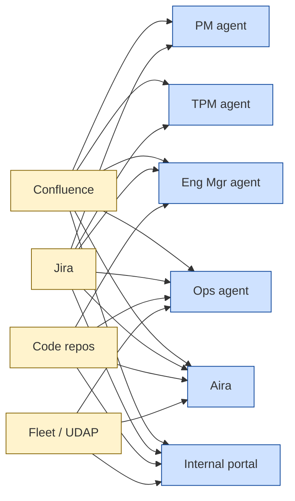

**Symptoms:**
- Slow, inconsistent answers across consumers
- High cost — every query re-pays the ingestion bill
- Drift — each agent has its own outdated snapshot
- No accountability — no single source of truth, no eval gates, no cost visibility
- Unscalable — onboarding a new persona-agent triples the integration burden

---

## 2. Vision — one knowledge layer, many consumers

A **central knowledge layer for LLM consumption**, polyglot by design (different stores for different access patterns), persona-driven (each persona team owns *what* to extract), and uniformly accessible (every consumer queries through one MCP retrieval surface).

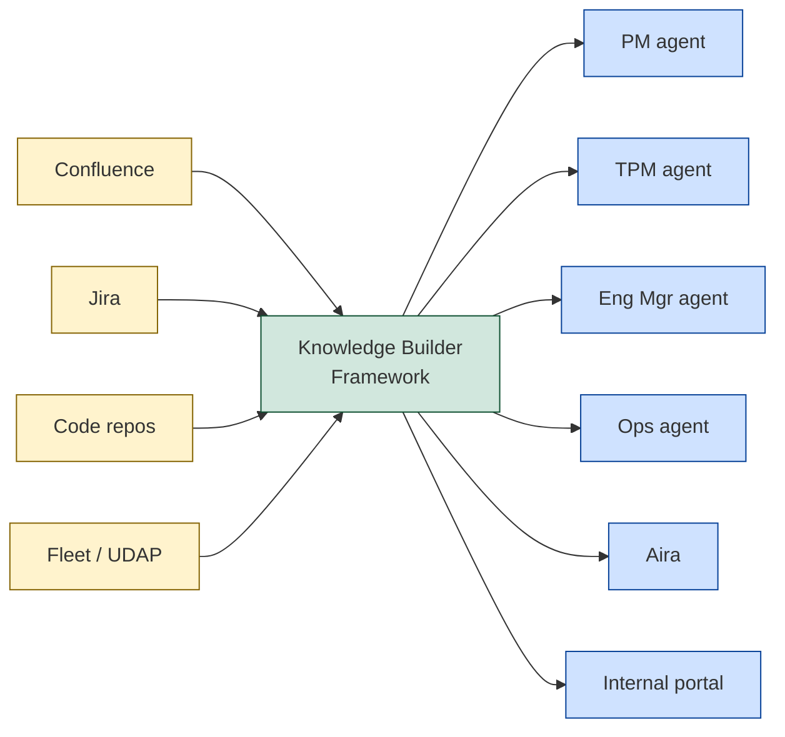

**One layer ingests. Many consumers query.** Citations everywhere; eval gates every change; costs are visible.

---

## 3. The two-population mental model

The framework distinguishes **producers** (humans + persona Knowledge Builders that *write* into the layer) from **consumers** (use-case agents that *read* from the layer).

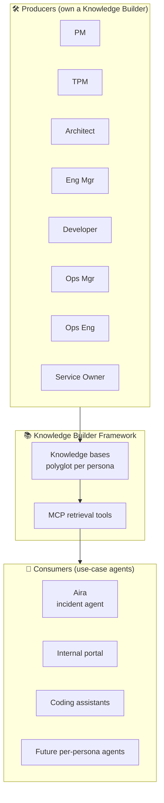

**v1 producers:** PM, TPM, Aira's incident KB. (DECISION-004)
**Deferred to v2+:** Architect, Eng Mgr, Developer, Ops Mgr, Ops Eng, Service Owner, Exec.

---

## 4. The five-layer architecture (bottom → top)

This is the layering you (the user) sketched, formalized.

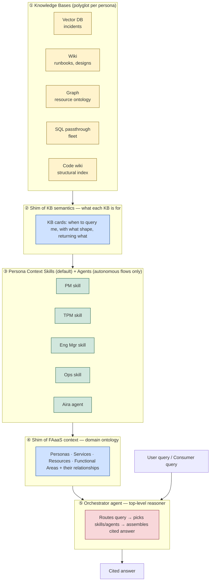

| # | Layer | What lives here | Who owns it |
|---|-------|-----------------|-------------|
| ① | Knowledge bases | One or more per persona, each in the right shape (vector/wiki/graph/SQL/code) | Persona teams via builder configs |
| ② | KB shim | "When to query this KB, with what input, returning what" — each KB self-describes | Auto-generated from builder configs |
| ③ | Persona skills (+ rare agents) | Per-persona context-building logic; fans out across that persona's KBs | Framework + persona prompts |
| ④ | FAaaS shim | The domain ontology: personas, services, resources, functional areas, relationships | Framework (sourced from API spec + curation) |
| ⑤ | Orchestrator agent | Classifies intent against the FAaaS shim; picks skills; merges results; cites | Framework |

**Why two shim layers?** The FAaaS shim (④) tells the orchestrator *what the world looks like* — this lets it route. The KB shim (②) tells each persona skill *what each of its KBs is for* — this lets it retrieve. Splitting them keeps the orchestrator's prompt small and lets persona reasoning live close to its data.

---

## 5. Polyglot per persona — knowledge_bases

A persona's "knowledge" is rarely one shape. The framework lets each persona declare a **bundle of knowledge_bases**, each with its own storage shape, source list, extraction schema, and retrieval tools.

```mermaid
flowchart LR
  classDef vector fill:#cfe2ff,stroke:#084298
  classDef wiki   fill:#d1e7dd,stroke:#0f5132
  classDef graph  fill:#f8d7da,stroke:#842029
  classDef sql    fill:#fff3cd,stroke:#856404

  subgraph OPS["Ops Engineer — knowledge_bases"]
    direction TB
    K1[ops_incidents<br/>📊 vector]:::vector
    K2[ops_runbooks<br/>📝 wiki / markdown]:::wiki
    K3[ops_postmortems<br/>📊 vector + 📝 wiki]:::vector
    K4[ops_dependencies<br/>🕸️ graph]:::graph
    K5[ops_fleet_state<br/>🗄️ sql passthrough]:::sql
  end

  subgraph PM["PM — knowledge_bases"]
    direction TB
    P1[pm_briefs<br/>📝 wiki]:::wiki
    P2[pm_release_plans<br/>📝 wiki]:::wiki
    P3[pm_market_research<br/>📊 vector]:::vector
  end
```

**Rule of thumb — match shape to the kind of knowledge:**

| Kind of knowledge | Shape | Example |
|---|---|---|
| Concepts, designs, decisions, runbooks, procedures | 📝 **Markdown wiki** | "POD refresh design", "Escalation runbook" |
| Incidents, support tickets, observations | 📊 **Vector DB + metadata** | "INC-12345: PODDB stuck refresh" |
| Resource & service relationships | 🕸️ **Property graph** | "POD contains PODDB", "service A depends on service B" |
| Fleet inventory, ticket fields, time-series state | 🗄️ **SQL passthrough** | "instances on patch 24.05.1" |
| Code structure | 📝 **Markdown wiki + symbol index** | "Where is auth implemented?" |

This is spec §2.1 ("polyglot, not unified") and §2.4 ("storage is consequence of retrieval pattern") applied **inside** a persona, not just across personas.

---

## 6. Multi-axis content organization

Each ContentItem produced by a persona builder lives at the intersection of **three or four independent dimensions**. We pick *one* primary axis per persona for storage layout; the rest are filterable tags.

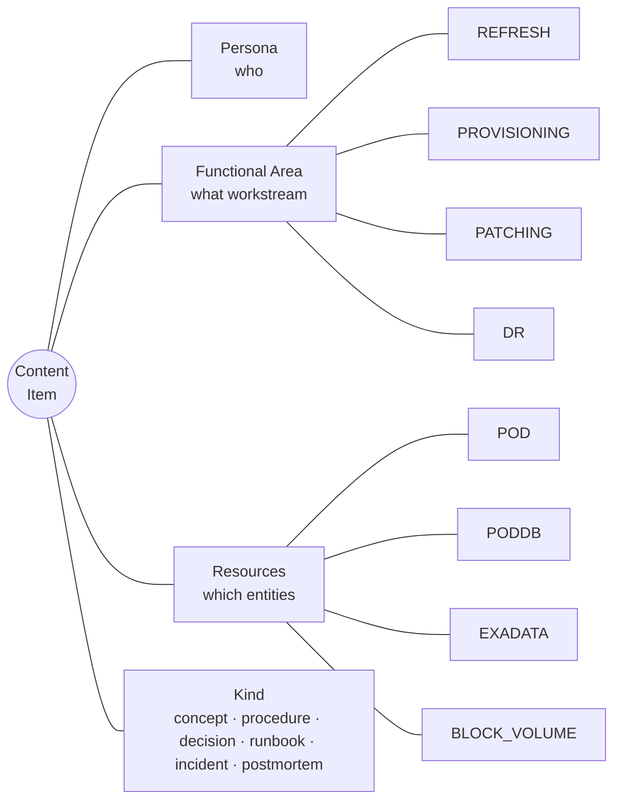

| Persona | Primary axis (folder structure) | Other axes (tags) |
|---|---|---|
| Eng Mgr / Ops Mgr / Ops Eng | functional_area | resources, kind, service_id |
| Service Owner | service_id | functional_area, resources, kind |
| Architect | functional_area (with service_id strong secondary) | resources, kind |
| PM | feature_or_release | functional_area, resources |
| TPM | program / initiative | functional_area, services, resources |
| Developer | service_id (or repo) | functional_area, kind |

**Cross-cutting pages** (rare but real, e.g., "POD refresh during PATCHING") get **multi-valued** `functional_area: [refresh, patching]` and live in their primary functional-area folder; retrieval finds them by either filter.

**Resource-centric views** (e.g., "everything about POD") are **derived** — auto-generated `kb-resources/pod/` cards aggregate references from every persona wiki via a CI step. Storage stays persona-scoped; views can be rebuilt anytime.

---

## 7. Skills vs Agents — the system shape

A critical structural decision: **persona-level workers are SKILLS by default**. Agents (autonomous loops) are reserved for genuinely open-ended flows.

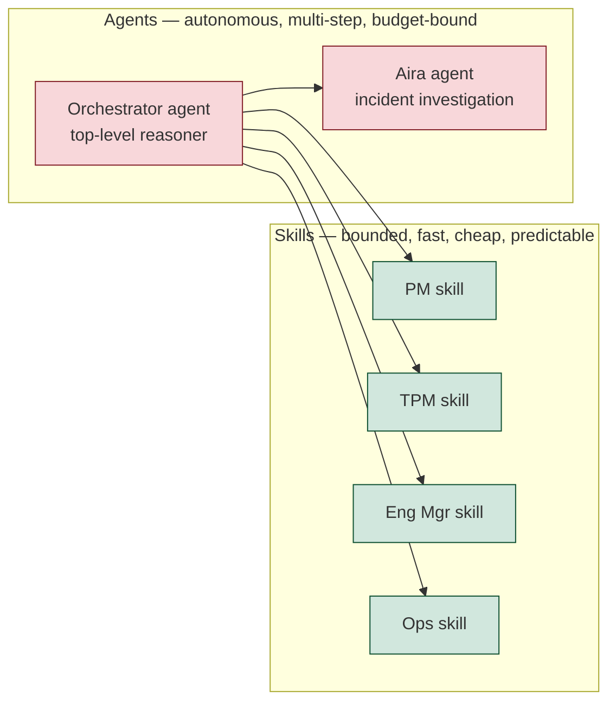

| | **Skill** | **Agent** |
|---|---|---|
| What it is | Function with fixed I/O | Loop with own context and decision-making |
| LLM calls | 1 per invocation | N×M (loops × tool calls) |
| Latency | bounded | variable |
| Cost | predictable | needs explicit budget |
| Best for | "Retrieve X persona's context for query Y" | "Investigate this incident across services" |
| Failure mode | misroutes a tool | runs over budget, loops |
| Default | ✅ | only when planning is needed |

**Result:** ~5× cheaper, ~2-3× faster, easier to debug, predictable SLOs. We can wrap a skill in an agent loop later if a use case demands it; going the other way means rewriting.

---

## 8. Retrieval flow — end-to-end example

A user (or consumer agent) asks: *"Why are POD refreshes stuck on large PODDBs in 25.01?"*

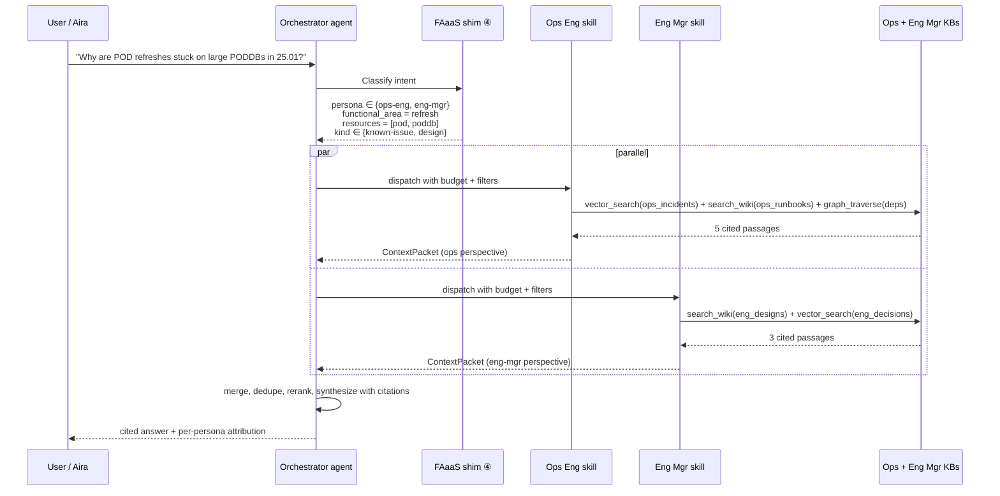

The user gets ONE answer, with citations from BOTH personas' knowledge_bases, with per-persona attribution showing which evidence came from where.

---

## 9. Tech stack (decided)

| Layer | Choice | Why |
|---|---|---|
| 🗄️ Converged data store | **Oracle 23ai Autonomous Database** | Vector + SQL + graph + JSON in one engine. Logical-polyglot, physical-converged. (DECISION-001/002) |
| 📊 Vector | Oracle 23ai AI Vector Search (HNSW, cosine) | Inside Autonomous DB. Native. |
| 🕸️ Graph | Oracle Property Graph | Inside Autonomous DB. Native. |
| 📝 Wiki content | Git (markdown + frontmatter) | Diff/PR/blame for free. Bodies in git, metadata in DB. |
| 🗄️ Fleet | Existing UDAP / Sentinel (read-through) | No data movement. Allowlisted views. |
| 🐍 Language | Python 3.12+ | Best LLM/embedding tooling. |
| 🤖 LLM + embeddings | **OpenAI** (Oracle-certified) — `gpt-4o`, `text-embedding-3-large` (3072 dim) | Maturity + Oracle compliance posture. (DECISION-003) |
| 🔁 Orchestration | **LangGraph on OCI** | Control + debuggability. |
| ☁️ Hosting | OCI Compute / Container Instances / Functions | Native to converged DB and Vault. |
| 🔐 Secrets | OCI Vault | All credentials (no `.env`). |
| 📦 Object storage | OCI Object Storage | Raw dumps, audit, eval artifacts. |
| 📡 Change events | OCI Streaming (Kafka-compatible) | Webhook fan-out. |
| 🧪 Eval | Custom recall/latency/cost runner + Ragas (faithfulness) | Spec §10 mandates eval discipline. (ADR-005) |

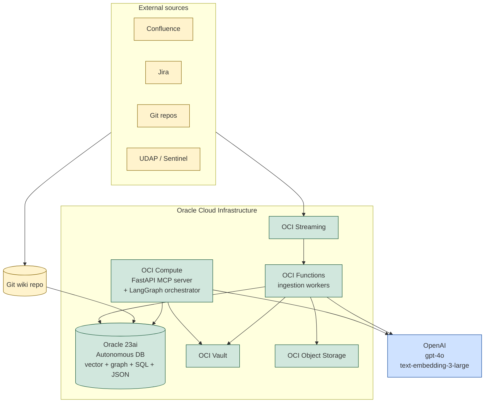

---

## 10. Cross-cutting requirements (from day one)

Per spec §10, **non-negotiable** v1 requirements built in from the start:

| Requirement | What it means | Where it shows up |
|---|---|---|
| 🏷️ **Citations** | Every retrieval returns source URLs/paths | `Result.citation_url` mandatory; no citation = bug |
| 🔁 **Idempotent ingestion** | Re-running ingest is a no-op when nothing changed | `id = sha256(source : source_id : schema_version)` |
| ⚡ **Incremental updates** | Webhooks, git push triggers, scheduled snapshots; full re-index only on schema/model change | OCI Streaming + change-detection module |
| 📌 **Versioning** | Every chunk carries `source_sha`, `parser_version`, `schema_version` | Enforced at `Store.upsert()` |
| 💵 **Cost telemetry** | Tokens/ingest, tokens/retrieve, $/run | Logged per call; daily roll-up |
| 🧪 **Eval harness** | Recall@k, faithfulness, latency, cost; per-persona gold sets; CI-blocking | `framework/eval/`, every parser/store/retriever PR |
| 🔒 **ACL placeholders** | `persona_visibility`, `owner`, `classification` on every ContentItem | v2 enforcement; v1 metadata-only |

---

## 11. Phase plan

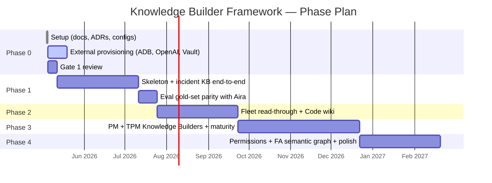

| Phase | Goal | Exit gate (measurable) |
|---|------|------------------------|
| **0 — Setup** ✅ done<br/>(your Gate-1 review pending) | Tech-stack baseline + interface contract + persona-builder contract + eval harness skeleton | ADRs approved by leadership; external services provisioned |
| **1 — Skeleton + incident KB** | Match or beat Aira's existing KB on 25-question gold set per persona | New incident → retrievable <5 min; vector_search top-5 with citations <500 ms p95; ≥80% recall on gold set; idempotency verified; eval CI green |
| **2 — Fleet + code wiki** | Mixed-source queries work | Context Builder answers cross-source queries (e.g., "show fleet state for tenants impacted by incident X") with citations |
| **3 — PM/TPM + maturity** | First persona builders ship; resolves spec §8.1 + §8.3 | PM and TPM knowledge_bases produce ≥80% recall@5 on persona gold sets; multi-source query latency p95 <2 s |
| **4 — Permissions + graph + polish** | v2-ready ops posture | `persona_visibility` enforced at retrieval layer; FA semantic graph integrated; cost dashboards live; eval CI hardened |

---

## 12. v1 scope (Phase 1 hard exit gate)

Operational incident KB, end-to-end. Non-incident personas defer to Phase 3+.

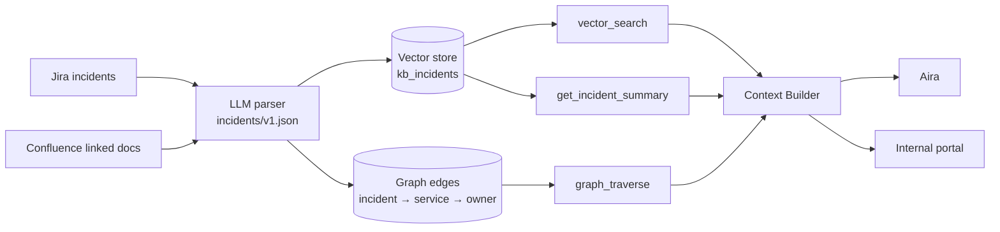

**v1 acceptance criteria** (spec §12, copied to dashboard):

- [ ] New incident → retrievable in <5 min
- [ ] `vector_search` returns top-5 with citations <500 ms p95
- [ ] Context Builder answers ≥80% of incident gold-set with grounded citations
- [ ] Re-ingesting same Jira ticket changes zero rows (idempotency)
- [ ] Eval harness runs on every PR; merge blocked on regression
- [ ] All ContentItems carry `persona_visibility` and `classification`
- [ ] Cost report: tokens/ingest, tokens/retrieve, daily totals

---

## 13. Persona model (reconciled)

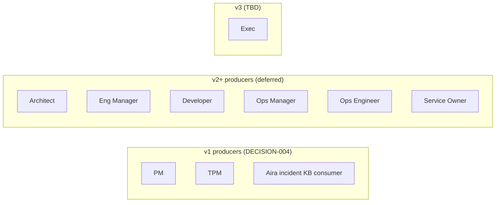

**v1 producers** (each ships a persona-builder config with knowledge_bases):
- **PM** — product definitions, feature briefs, release plans (Confluence, Jira PM-* epics)
- **TPM** — weekly ops summaries, ECARs, dependency tracking (Confluence, Jira OPS-*)
- **Aira's incident KB** — already-proven path; matches Phase-1 exit gate

**v2 producers** (Phase 4+, each on the same ADR-004 contract):
- **Architect** — design docs, ADRs, system maps
- **Eng Manager** — engineering execution, story breakdown, code-quality data
- **Developer** — code structural index (covered by code-wiki module)
- **Ops Manager** — SLAs, escalation paths, customer-impact tracking
- **Ops Engineer** — runbooks, incident-history, fleet operations
- **Service Owner** — per-service catalog, ownership, SLOs

**Aira** is a **consumer**, not a producer — uses every persona's knowledge_bases as needed.

---

## 14. Functional areas & resources (FAaaS shim)

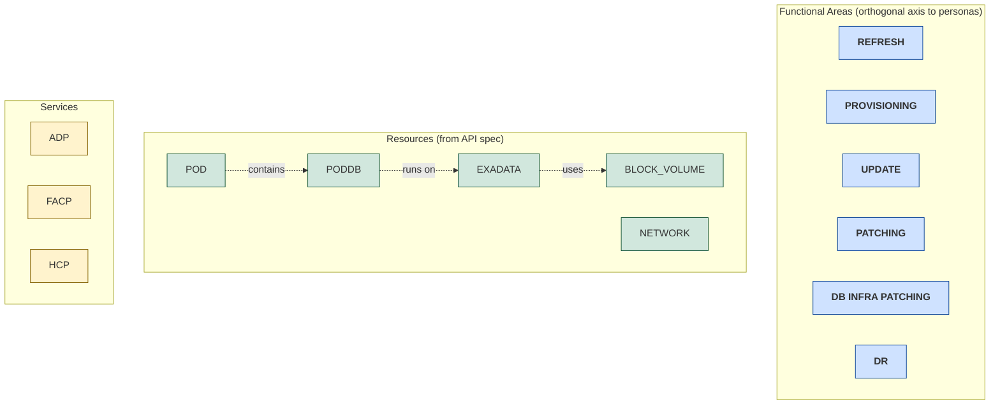

- **Functional area is NOT a persona** — it's a workstream that crosses personas. Encoded as a metadata tag (multi-valued for cross-cutting pages) on every ContentItem and as a retrieval filter.
- **Resources** come from the API spec (POD, PODDB, EXADATA, BLOCK_VOLUME, …) and have parent/child relationships modeled in the property graph (the FAaaS shim's resource ontology).
- **Services** (ADP, FACP, HCP) are first-class entities owning resources and being touched by functional areas.

---

## 15. Persona-builder config — the contract

A persona team ships **one YAML + one JSON-Schema** to plug their persona into the framework. The framework provides the rest.

```yaml
# framework/persona_builders/ops-eng.yaml — illustrative
persona: ops-eng
display_name: "Ops Engineer Knowledge Builder"
schema_version: 1
status: draft

primary_axis: functional_area
functional_areas: [refresh, provisioning, patching, dr]
resources_relevant: [pod, poddb, exadata, block_volume]
kinds_supported: [concept, procedure, runbook, design, decision, incident-history, postmortem]

knowledge_bases:
  - name: ops_incidents
    kind: vector
    extraction_schema: parsers/schemas/incidents/v1.json
    sources: [{ kind: jira, jql: 'project IN (OPS, P2T)' }]
    retrieval_tools: [vector_search, get_incident_summary]
  - name: ops_runbooks
    kind: wiki
    extraction_schema: parsers/schemas/runbooks/v1.json
    sources:
      - { kind: confluence, space: OPS-RUNBOOKS }
      - { kind: git, repo: org/ops-runbooks, paths: ["**/*.md"] }
    retrieval_tools: [search_wiki, read_wiki_page]
  - name: ops_dependencies
    kind: graph
    sources: [derived]
    retrieval_tools: [graph_traverse]
  - name: ops_fleet_state
    kind: sql_passthrough
    sources: [{ kind: udap, views: [pod_health, restart_counts] }]
    retrieval_tools: [query_fleet, text_to_sql]

metadata_defaults:
  persona_visibility: [ops-eng, ops-mgr, dev-mgr, aira]
  owner: ops-eng
  classification: internal

eval:
  gold_set: eval/gold_sets/ops-eng.jsonl
  exit_criteria: { recall_at_5: 0.80, faithfulness: 0.85, p95_latency_ms: 800 }
```

**Lifecycle:** draft → `validate` → `dry-run` (5 sample items, human review) → `eval` (gold-set passes) → `promote` to production.

This **resolves spec §8.3** (the open problem of who decides what to extract for non-incident personas): the framework defines the contract; persona teams own their schemas + gold sets.

---

## 16. Open problems → research items

These remain explicitly unsolved per spec §8 and are tracked as future DECISIONs:

| # | Problem | Phase | Default direction | Decision target |
|---|---------|-------|-------------------|-----------------|
| §8.1 | LLM wiki retrieval for remote agents | 3 | TOC + on-demand fetch + BM25 (Oracle Text) when measured-needed; vector only if BM25 misses paraphrases | DECISION-006 at Phase 3 kickoff |
| §8.2 | Code accessibility for remote agents | 2 | Hybrid: pre-built code wiki for read-only Q&A; VM-spinup only for write/PR flows | DECISION-005 at Phase 2 kickoff |
| §8.3 | TPM/PM extraction schemas | 3 | Resolved by ADR-004 contract; persona teams author concrete schemas | per-persona PRs |
| §4.6 | Jira roadmap aggregation | 4+ | Defer; PM Knowledge Builder answers via filters in v1 | DECISION-009 at Phase 4 |

---

## 17. What changes when this is in place

```mermaid
flowchart LR
  classDef before fill:#f8d7da,stroke:#842029
  classDef after  fill:#d1e7dd,stroke:#0f5132

  subgraph Before["Before"]
    direction TB
    B1[Every agent re-scrapes context]:::before
    B2[Inconsistent answers across consumers]:::before
    B3[No cost visibility]:::before
    B4[No eval gates]:::before
    B5[New persona-agent = new integration tax]:::before
  end

  subgraph After["After"]
    direction TB
    A1[One layer ingests; many query]:::after
    A2[Citations + per-persona attribution]:::after
    A3[Tokens-per-query reported daily]:::after
    A4[CI-blocking eval on every PR]:::after
    A5[New persona = one YAML + one schema]:::after
  end

  Before --> After
```

---

## 18. Open architectural decisions to formalize as ADRs

Captured in this PDD; pending separate ADR drafts:

- **ADR-006** — Two-shim layered architecture (`shim_kb` + `shim_faaas`)
- **ADR-007** — Persona context skill contract (input, output, prompt template, budget enforcement)
- **ADR-008** — Functional-area + resources dimensions (multi-valued tags, retrieval filters, cross-cutting handling)
- **ADR-009** — Resource ontology (FA semantic graph applied to FAaaS resources)
- **ADR-004 amendment** — `corpora:` → `knowledge_bases:`; document the polyglot-per-persona principle; add KB cards

---

## 19. Acceptance criteria for this PDD

- [ ] Leadership review (this document)
- [ ] DECISION-001..004 reaffirmed
- [ ] Persona list (§13) reconciled with org reality
- [ ] Functional-area enum (§14) confirmed against spec catalog
- [ ] Phase 1 success metrics (§12) approved as the v1 contract
- [ ] Open problems (§16) accepted as research items, not implementation blockers

---

## 20. Glossary

- **Knowledge base (KB)** — a single shape-coherent body of knowledge owned by a persona (e.g., `ops_incidents` is a vector KB; `ops_runbooks` is a wiki KB).
- **Knowledge Builder** — the LLM-driven configuration (YAML + extraction schema) that ingests sources into one or more knowledge_bases for a given persona.
- **KB card / shim_kb** — the self-description of a KB: when to query it, with what shape, returning what.
- **shim_faaas** — the FAaaS domain ontology (personas, services, resources, functional areas, relationships).
- **Persona Context Skill** — a function that, given a query + intent signal, returns a cited ContextPacket from that persona's knowledge_bases.
- **Aira** — Oracle's existing remote agent for incident response; the framework's first consumer.
- **UDAP / Sentinel** — existing Oracle fleet/ops data store, accessed read-through.
- **Functional area** — a workstream (REFRESH, PROVISIONING, PATCHING, DR, …) that crosses personas.
- **Resource** — a business entity in the API spec (POD, PODDB, EXADATA, …) that knowledge can reference.
- **MCP** — Model Context Protocol; the uniform tool interface every retrieval surfaces through.
- **Citation** — source URL/path returned with every retrieval result; non-negotiable.
- **Idempotent ingestion** — re-running ingestion changes zero rows when source content is unchanged.
- **Polyglot, not unified** — different data types live in different stores (or schemas in our converged-DB realization).

---

## References

- Source spec: [`docs/raw/knowledge-builder-framework-spec.md`](../../raw/knowledge-builder-framework-spec.md)
- Per-persona builder concept: [`persona-knowledge-builder.md`](../persona-knowledge-builder.md)
- ADRs: [`adr/`](../adr/)
- DECISIONs: [`pmo/decisions/`](../../../pmo/decisions/)
- Phase plan: [`pmo/phases.md`](../../../pmo/phases.md)
- Phase 0 kickoff: [`pmo/phase-briefs/PHASE-0-kickoff.md`](../../../pmo/phase-briefs/PHASE-0-kickoff.md)
